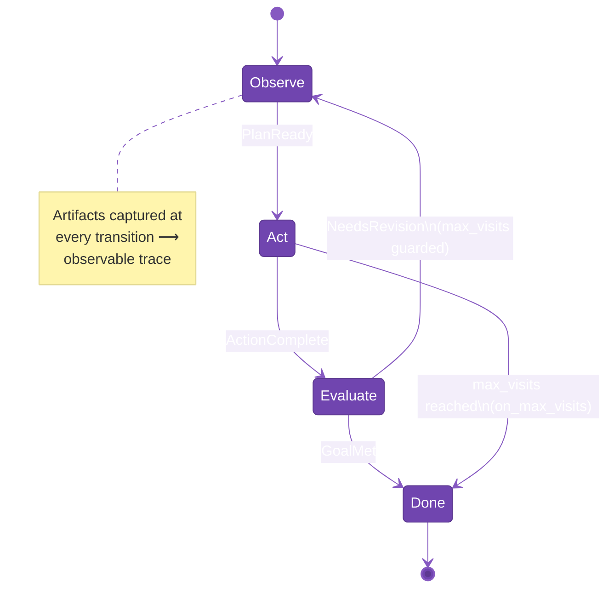
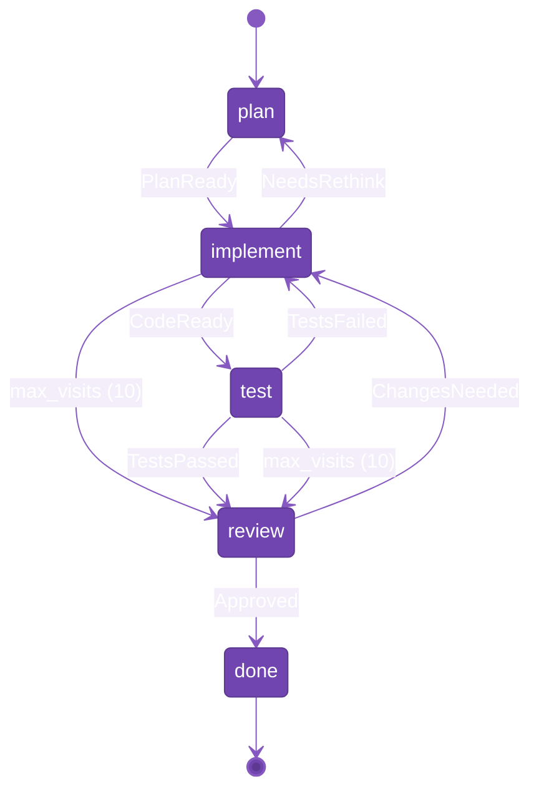

# RFC 0009: Agent Loop Extension

- **Status:** Draft
- **Author(s):** AltairaLabs Team
- **Created:** 2026-03-26
- **Updated:** 2026-03-26
- **Related Issues:** N/A

## Summary

Extend the PromptPack workflow model (RFC 0005) to support agent loops — iterative, self-correcting execution patterns where an agent repeatedly observes, acts, and evaluates until a goal is reached or a budget is exhausted. The extension adds four concepts to the existing workflow state machine: terminal states, loop guards, artifacts (lightweight transition metadata that enables time-travel debugging and observability), and execution budgets. No new orchestration model is introduced — loops are expressed as cycles in the existing state graph.

## Motivation

The workflow extension (RFC 0005) introduced a state machine over prompts with event-driven transitions. The existing model already permits cycles — a state's `on_event` can point back to itself or to an earlier state. This means the *mechanism* for looping exists, but the *guardrails* and *context management* for safe, productive loops do not.

Agent loops are the dominant pattern in autonomous AI systems. They appear across domains:

- **Code generation**: plan → write code → run tests → if tests fail, revise code → repeat
- **Data exploration**: form hypothesis → query data → analyze results → refine hypothesis → repeat
- **Research synthesis**: search → read → synthesize → identify gaps → search again → repeat
- **Document generation**: draft → review against criteria → revise → repeat until quality bar met
- **Autonomous ops**: monitor → detect anomaly → diagnose → remediate → verify fix → repeat
- **ETL / data pipelines**: discover schema → map fields → transform → validate → fix mapping errors → repeat
- **Simulation / what-if analysis**: set parameters → run simulation → analyze results → adjust → repeat
- **Security audit**: scan → triage findings → investigate → classify (true/false positive) → next finding → repeat
- **Planning and re-planning**: plan → execute step → observe outcome → re-plan if unexpected → repeat

These patterns share a common structure: iterate with accumulated context until a termination condition is met or resources run out.

### Current Limitations

Without loop-specific extensions, developers must:

- **Hope cycles terminate** — no `max_visits` guard means a self-transition can run forever, consuming unbounded tokens and time
- **Lose intermediate state** — the `persistence` hint (transient/persistent) controls conversation history, but there's no structured way to carry transition metadata (commit refs, result summaries, error classifications) across loop iterations
- **Guess at completion** — no explicit terminal states means a state with an empty `on_event` is ambiguous: is it finished, or is it misconfigured?
- **Implement budgets in runtime code** — the `engine` block accepts arbitrary hints, but there's no standard vocabulary for resource limits

This leads to:

- **Unbounded execution** — agent loops with no termination guarantee are a safety and cost risk
- **Lost transition context** — each loop iteration starts without structured access to what prior iterations produced or decided
- **Implicit termination** — readers can't distinguish terminal states from incomplete workflow definitions
- **Non-portable budgets** — every runtime invents its own budget mechanism

### Goals

- Enable safe, bounded agent loops using the existing workflow state machine
- Provide structured artifact passing between loop iterations
- Define explicit terminal states for clear workflow completion
- Standardize execution budget vocabulary in the `engine` block
- Maintain full backward compatibility with existing workflow definitions

### Non-Goals

- Introduce imperative control flow (if/else, while loops, expressions) into the spec
- Define parallel state execution or fork/join patterns (deferred per RFC 0005, Question 5)
- Specify how runtimes implement loop execution, context windowing, or artifact storage
- Define session memory, conversation history, or long-term memory — these are runtime concerns
- Replace or subsume the agents extension (RFC 0007) — agent loops are intra-agent, agents are inter-agent
- Define nested loop constructs — nested loops are achieved by composing agents (see Design Notes)
- Define artifact schemas or validation beyond type declarations

## Detailed Design

### Core Insight

An agent loop is a cycle in a directed graph — and the workflow state machine is already a directed graph. Rather than introducing a new loop construct, this RFC adds the missing pieces that make cycles practical:

1. **Terminal states** — explicit "the workflow is done" markers
2. **Loop guards** — per-state visit limits with forced-exit transitions
3. **Artifacts** — lightweight, typed metadata (pointers, summaries, compact results) captured at each state transition, enabling both context passing and time-travel debugging
4. **Budgets** — standardized resource limits in the `engine` block

Together, these turn the workflow model from a conversational state machine into an agent loop runtime — without changing its fundamental nature.

The generic agent loop pattern looks like this:



### Schema Changes

#### Modified Definition: `WorkflowState`

Three new optional properties are added to `WorkflowState`:

```json
{
  "WorkflowState": {
    "type": "object",
    "description": "A single state in the workflow state machine. References a prompt task and declares event-driven transitions to other states. May be marked as terminal to indicate workflow completion, or guarded with max_visits to bound loop iterations.",
    "required": ["prompt_task"],
    "additionalProperties": false,
    "properties": {
      "prompt_task": {
        "type": "string",
        "description": "Reference to a prompt key defined in the pack's prompts object."
      },
      "description": {
        "type": "string",
        "description": "Human-readable description of this state's purpose."
      },
      "on_event": {
        "type": "object",
        "description": "Map of event name to target state name. When the named event fires, the workflow transitions to the target state.",
        "additionalProperties": {
          "type": "string"
        }
      },
      "persistence": {
        "type": "string",
        "description": "Whether conversation context is kept (persistent) or reset (transient) on entry.",
        "examples": ["transient", "persistent"]
      },
      "orchestration": {
        "type": "string",
        "description": "How this state is orchestrated: internal (runtime manages), external (caller manages), or hybrid.",
        "examples": ["internal", "external", "hybrid"]
      },
      "skills": {
        "type": "string",
        "description": "Skill filter for this workflow state (per RFC 0008)."
      },

      "terminal": {
        "type": "boolean",
        "description": "If true, this state is a terminal state. The workflow completes after this state's prompt executes. Terminal states should not declare on_event transitions.",
        "default": false,
        "examples": [true]
      },

      "max_visits": {
        "type": "integer",
        "description": "Maximum number of times this state can be entered during a single workflow execution. When the limit is reached, the workflow transitions to the state named in on_max_visits. If on_max_visits is not set, the workflow terminates.",
        "minimum": 1,
        "examples": [5, 10, 20]
      },
      "on_max_visits": {
        "type": "string",
        "description": "Target state to transition to when max_visits is reached. Must reference a key in the states object. If omitted and max_visits is reached, the workflow terminates with a budget-exhausted status.",
        "examples": ["review", "summarize", "error_handler"]
      },

      "artifacts": {
        "type": "object",
        "description": "Named artifact slots for lightweight, structured metadata that flows across state visits. Artifacts should be pointers (commit SHAs, URIs), compact representations (schemas, summaries, diffs), or small structured results — not bulk data. Artifact values are available to the prompt as template variables under the 'artifacts' namespace (e.g., {{artifacts.commit_sha}}).",
        "additionalProperties": {
          "$ref": "#/$defs/ArtifactDef"
        },
        "examples": [
          {
            "commit_sha": { "type": "text/plain", "description": "Git commit of the latest generated code" },
            "test_report": { "type": "application/json", "description": "Structured test runner summary" }
          }
        ]
      }
    }
  }
}
```

#### New Definition: `ArtifactDef`

```json
{
  "ArtifactDef": {
    "type": "object",
    "description": "Declares a named artifact slot for carrying lightweight, structured metadata across workflow state visits. Artifacts are typically pointers (commit SHAs, file paths, URIs), compact representations (schemas, summaries, diffs), or small structured results — not bulk data. Values are captured at each state transition, forming an observable trace that enables time-travel debugging and workflow audit. They persist across loop iterations and are accessible to prompts as template variables.",
    "required": ["type"],
    "additionalProperties": false,
    "properties": {
      "type": {
        "type": "string",
        "description": "MIME type indicating the artifact's content type. Used by runtimes to determine serialization and presentation.",
        "examples": ["text/plain", "application/json", "text/markdown", "text/x-python"]
      },
      "description": {
        "type": "string",
        "description": "Human-readable description of what this artifact contains and how it's used."
      },
      "mode": {
        "type": "string",
        "description": "How the artifact is updated across visits. 'replace' overwrites the previous value on each visit. 'append' accumulates content across visits (e.g., a log). Defaults to 'replace'.",
        "enum": ["replace", "append"],
        "default": "replace",
        "examples": ["replace", "append"]
      }
    }
  }
}
```

#### New Definition: `WorkflowBudget`

Added as a standardized property within the `engine` block:

```json
{
  "WorkflowBudget": {
    "type": "object",
    "description": "Resource budget for workflow execution. Provides a safety net to prevent unbounded loops. When any budget limit is reached, the workflow terminates with a budget-exhausted status. All fields are optional — omitting a field means no limit for that resource.",
    "additionalProperties": false,
    "properties": {
      "max_total_visits": {
        "type": "integer",
        "description": "Maximum total state visits across all states in the workflow. This is a global safety net independent of per-state max_visits.",
        "minimum": 1,
        "examples": [50, 100, 200]
      },
      "max_tool_calls": {
        "type": "integer",
        "description": "Maximum total tool calls across all states in the workflow.",
        "minimum": 1,
        "examples": [100, 500]
      },
      "max_wall_time_sec": {
        "type": "integer",
        "description": "Maximum wall-clock time in seconds for the entire workflow execution.",
        "minimum": 1,
        "examples": [300, 600, 3600]
      }
    }
  }
}
```

#### Modified Definition: `WorkflowConfig`

The `engine` block gains a standardized `budget` property alongside its existing `additionalProperties: true` behavior:

```json
{
  "WorkflowConfig": {
    "properties": {
      "engine": {
        "type": "object",
        "description": "Optional runtime engine configuration for workflow execution.",
        "properties": {
          "budget": {
            "$ref": "#/$defs/WorkflowBudget",
            "description": "Resource budget for workflow execution. Provides safety limits to prevent unbounded loops."
          }
        },
        "additionalProperties": true
      }
    }
  }
}
```

### How Agent Loops Work

1. **Define the cycle**: Use `on_event` transitions to create cycles in the state graph. A state can transition to itself (self-loop) or to any earlier state (back-edge).

2. **Guard the cycle**: Set `max_visits` on states that participate in loops. When the visit count is reached, the workflow transitions to `on_max_visits` (or terminates if omitted).

3. **Carry context**: Declare `artifacts` on states that need structured working memory. The runtime populates artifact values from tool results or LLM output and makes them available to the prompt as template variables on subsequent visits.

4. **Set a budget**: Declare `engine.budget` with global resource limits as a safety net. Per-state `max_visits` handles expected iteration counts; the global budget catches unexpected runaway behavior.

5. **Mark the exit**: Set `terminal: true` on states that represent workflow completion. This makes the state graph's exit points explicit and unambiguous.

### Artifact Lifecycle

Artifacts follow a simple lifecycle:

1. **Declaration**: States declare artifact slots with a MIME type and optional constraints.
2. **Population**: During state execution, the runtime captures values from tool results or LLM output and writes them to artifact slots. The mapping from tool results to artifacts is a runtime concern (e.g., convention-based, explicit tool-result bindings in `engine`).
3. **Capture**: The runtime snapshots artifact values at each state transition — the artifact value, the source state, the triggering event, and the target state form a single transition record.
4. **Access**: On subsequent visits to the state (or transitions to other states that declare the same artifact name), the *current* artifact values are available as template variables under `{{artifacts.<name>}}`.
5. **Update**: Each visit can update the artifact. In `replace` mode, the new value overwrites the current value. In `append` mode, the new value is appended. Both modes produce a new transition record in the history.
6. **Completion**: When the workflow reaches a terminal state or is budget-exhausted, final artifact values are available as workflow output. The full transition history is available for debugging and audit.

Artifacts share a **workflow-scoped namespace**: if two states both declare `artifacts.code`, they reference the same artifact. State A can write it; state B can read and update it. This is the simplest model and matches how developers think about working memory. See Design Notes: Relationship to Runtime Memory for how artifacts relate to session memory and why this distinction enables time-travel debugging.

### Design Notes

#### Relationship to Runtime Memory

Artifacts are **not** a memory system. They are typed, workflow-scoped data slots that are captured as part of each state transition — making them the observable, replayable record of what happened during workflow execution.

This distinction is fundamental:

- **Memory** is point-in-time. A runtime's session memory tells you what the agent knows *right now* — but not how it got there, what it tried and discarded, or what the data looked like three iterations ago. You could add time-travel to a memory system, but the snapshots would be devoid of transition context (which state? which event? why did the agent move on?).

- **Artifacts** are transition-scoped. Because they're captured at each state visit alongside the event that triggered the transition, the full artifact history gives you a structured trace: state A produced this code → event `TestsFailed` → state B saw these errors → event `CodeReady` → state A produced revised code. This enables **time-travel debugging** and **workflow observability** as first-class capabilities — runtimes can replay, inspect, and visualize every step of an agent loop.

| Concern | Mechanism | Scope | Defined by | Observable? |
|---------|-----------|-------|------------|-------------|
| Conversation history | Runtime session memory | Across turns within a state | Runtime | Point-in-time only |
| Cross-state conversational context | Runtime session memory + `persistence` hint | Across state transitions | Runtime (informed by spec) | Point-in-time only |
| Structured transition metadata (pointers, summaries, compact results) | Artifacts | Across state visits within a workflow execution | Pack author (this RFC) | **Full history at every transition** |
| Long-term recall across sessions | Runtime memory system | Across workflow executions | Runtime | Point-in-time only |

A runtime that captures artifact values at every state transition gets a complete, structured execution trace for free. This is far more useful for debugging, auditing, and optimization than replaying conversation logs — because artifacts carry the *data* that drove each decision, not just the *words* around it.

Artifacts are opt-in and intentionally lightweight. They should be pointers to immutable state (a commit SHA, an S3 URI, a query ID), compact representations (a schema diff, a structured summary, a BAML description of what changed), or small structured results (a test report, a list of findings) — not bulk data. The actual data lives wherever it naturally lives (git, a database, object storage); the artifact is the reference that makes the transition trace meaningful and replayable.

A runtime with rich session memory can carry conversational context implicitly — artifacts add value for structured metadata that you want in the observable transition trace.

Example artifact trace for a codegen loop — each row captures artifact values at that state transition:

```
 Transition       │ Event        │ commit_sha │ test_report │
──────────────────┼──────────────┼────────────┼─────────────┤
 → plan           │ (entry)      │ —          │ —           │
 → implement (1)  │ PlanReady    │ —          │ —           │
 → test (1)       │ CodeReady    │ abc123     │ —           │
 → implement (2)  │ TestsFailed  │ abc123     │ 2/5 pass    │
 → test (2)       │ CodeReady    │ def456     │ 2/5 pass    │
 → review         │ TestsPassed  │ def456     │ 5/5 pass    │
 → done           │ Approved     │ def456     │ 5/5 pass    │
```

The full trace is a replayable record of what the agent produced and knew at every step — each row is a snapshot you can inspect, diff, or replay.

#### Nested Loops

Some use cases involve nested iteration — for example, a security audit that loops over findings (outer loop), where investigating each finding is itself an iterative process (inner loop). This RFC does not introduce nested state machines.

Instead, nested loops are achieved by **composing agents** via RFC 0007. The outer loop is one agent's workflow; the inner loop is a separate agent's workflow. The outer agent delegates to the inner agent via a tool call (resolved as an A2A call by the runtime):

```yaml
# Outer agent's workflow
states:
  triage:
    prompt_task: triage_findings
    max_visits: 20
    on_event:
      NextFinding: investigate
      AllTriaged: report
  investigate:
    prompt_task: coordinator
    # This prompt calls the 'deep_investigator' tool,
    # which the runtime resolves to a separate agent
    # that has its own workflow with its own loop
    on_event:
      InvestigationComplete: triage
```

This keeps the workflow model flat and composes complexity through agents — consistent with RFC 0007's design philosophy that workflows are intra-agent and agents are inter-agent.

#### Human-in-the-Loop

Many agent loop patterns benefit from human checkpoints — a reviewer approving generated code, a data scientist confirming a hypothesis direction, an operator authorizing a remediation action. This RFC does not prescribe a single HITL mechanism because multiple valid patterns exist:

1. **External orchestration**: Set `orchestration: "external"` on a state. The runtime pauses and waits for an external system (or human) to emit the transition event.
2. **Async tool call**: A tool like `request_human_review` creates a review request and returns asynchronously when the human responds. The agent loop waits on the tool result like any other tool call.
3. **Event from outside**: The workflow pauses at a state with no self-transition. An external system injects an event (e.g., `Approved` or `ChangesNeeded`) when the human acts.

All three patterns work with the existing workflow model and the additions in this RFC. The `max_visits` guard ensures the loop doesn't run away while waiting for human input, and `terminal` states provide clear completion points.

### Specification Impact

- `WorkflowState` gains three optional properties: `terminal`, `max_visits`/`on_max_visits`, and `artifacts`
- A new `ArtifactDef` definition is added to `$defs`
- A new `WorkflowBudget` definition is added to `$defs`
- The `engine` block on `WorkflowConfig` gains a standardized `budget` property
- All existing fields and definitions remain unchanged
- Workflows without these new fields are unaffected

### Validation Rules

1. **Terminal state consistency**: If `terminal` is true, `on_event` should be empty or omitted. Validators should warn if a terminal state declares transitions (they would never fire).

2. **Loop guard references**: `on_max_visits` must reference a valid key in the `states` object. If the target state itself has `max_visits`, ensure the workflow can still terminate (no infinite forced-exit chains).

3. **Artifact name uniqueness**: Artifact names must be unique within a state's `artifacts` object (enforced by JSON object key uniqueness).

4. **Artifact template references**: If a prompt template references `{{artifacts.<name>}}`, the corresponding workflow state should declare that artifact. Validators should warn on mismatches.

5. **Budget coherence**: If `engine.budget.max_total_visits` is set, it should be >= the sum of all reachable states' `max_visits` values. Warn if per-state limits exceed the global budget (they'd never be reached).

6. **Backward compatibility**: All new fields are optional. Existing workflows without `terminal`, `max_visits`, `artifacts`, or `budget` remain valid and behave as before.

7. **Reachability**: Validators should warn if a non-terminal state has no outgoing transitions and no `max_visits` — this is ambiguous (is it terminal, or is it misconfigured?).

## Examples

### Example 1: Codegen Agent Loop

A code generation workflow that plans, implements, tests, and reviews — with the implement/test cycle bounded by `max_visits`.



> YAML shown for readability (per [RFC 0002](./0002-yaml-format.md)). All examples are equally valid as JSON.

```yaml
id: codegen-agent
name: Code Generation Agent
version: 1.0.0
template_engine:
  version: v1
  syntax: "{{variable}}"

prompts:
  planner:
    id: planner
    name: Implementation Planner
    version: 1.0.0
    system_template: |
      You are a software architect. Given the requirements, create a
      step-by-step implementation plan.

      Requirements: {{requirements}}
    variables:
      - name: requirements
        type: string
        required: true

  coder:
    id: coder
    name: Code Writer
    version: 1.0.0
    system_template: |
      You are an expert programmer. Write code according to the plan.

      Plan: {{plan}}

      Previous attempt (empty on first iteration): {{artifacts.commit_sha}}
      What was changed: {{artifacts.change_summary}}
      Test results: {{artifacts.test_report}}

      If there are test failures from a previous attempt, fix them
      while preserving passing behavior.
    tools: [write_file, read_file]
    parameters:
      temperature: 0.2

  test_runner:
    id: test_runner
    name: Test Runner
    version: 1.0.0
    system_template: |
      Run the test suite against the generated code and report results.

      Code revision: {{artifacts.commit_sha}}
    tools: [run_tests, read_file]
    parameters:
      temperature: 0.0

  reviewer:
    id: reviewer
    name: Code Reviewer
    version: 1.0.0
    system_template: |
      Review the final code for quality, correctness, and style.

      Code revision: {{artifacts.commit_sha}}
      Changes: {{artifacts.change_summary}}
      Test results: {{artifacts.test_report}}
    parameters:
      temperature: 0.3

  summarizer:
    id: summarizer
    name: Summary Generator
    version: 1.0.0
    system_template: |
      Summarize what was built, key decisions made, and any remaining concerns.

      Final revision: {{artifacts.commit_sha}}
      Change log: {{artifacts.change_summary}}

tools:
  write_file:
    name: Write File
    description: Write content to a file
    parameters:
      type: object
      properties:
        path: { type: string }
        content: { type: string }
      required: [path, content]
  read_file:
    name: Read File
    description: Read content from a file
    parameters:
      type: object
      properties:
        path: { type: string }
      required: [path]
  run_tests:
    name: Run Tests
    description: Execute the test suite and return results
    parameters:
      type: object
      properties:
        test_path: { type: string }
      required: [test_path]

workflow:
  version: 2
  entry: plan

  engine:
    budget:
      max_total_visits: 30
      max_tool_calls: 200
      max_wall_time_sec: 600

  states:
    plan:
      prompt_task: planner
      description: Create an implementation plan from requirements
      on_event:
        PlanReady: implement

    implement:
      prompt_task: coder
      description: Write or revise code based on plan and test feedback
      max_visits: 10
      on_max_visits: review
      artifacts:
        commit_sha:
          type: text/plain
          description: Git commit SHA of the latest generated code
        change_summary:
          type: text/markdown
          description: Compact summary of what was changed and why
        test_report:
          type: application/json
          description: Structured test result summary (pass/fail counts, failure messages)
      on_event:
        CodeReady: test
        NeedsRethink: plan

    test:
      prompt_task: test_runner
      description: Run tests against the generated code
      max_visits: 10
      on_max_visits: review
      artifacts:
        test_report:
          type: application/json
          description: Structured test result summary
      on_event:
        TestsPassed: review
        TestsFailed: implement

    review:
      prompt_task: reviewer
      description: Review the final code for quality
      on_event:
        Approved: done
        ChangesNeeded: implement

    done:
      prompt_task: summarizer
      description: Generate a summary of what was built
      terminal: true
```

### Example 2: Agentic Data Exploration

An iterative data exploration workflow where the agent forms hypotheses, queries data, and refines its understanding.

```yaml
id: data-explorer
name: Agentic Data Explorer
version: 1.0.0
template_engine:
  version: v1
  syntax: "{{variable}}"

prompts:
  hypothesizer:
    id: hypothesizer
    name: Hypothesis Former
    version: 1.0.0
    system_template: |
      You are a data scientist. Given the dataset description and any
      previous findings, form the next hypothesis to investigate.

      Dataset: {{dataset_description}}

      Previous findings (empty on first iteration):
      {{artifacts.findings}}

      Queries already executed (avoid repeating these):
      {{artifacts.queries_run}}
    variables:
      - name: dataset_description
        type: string
        required: true

  querier:
    id: querier
    name: Data Querier
    version: 1.0.0
    system_template: |
      Write and execute a SQL query to test the current hypothesis.
      Return the query ID and summary statistics, not full result sets.

      Hypothesis: {{artifacts.current_hypothesis}}
      Dataset: {{dataset_description}}
    tools: [run_query, describe_table]
    parameters:
      temperature: 0.1

  analyst:
    id: analyst
    name: Results Analyst
    version: 1.0.0
    system_template: |
      Analyze the query results in the context of the hypothesis.
      Determine whether the hypothesis is supported, refuted, or inconclusive.

      Hypothesis: {{artifacts.current_hypothesis}}
      Query summary: {{artifacts.query_result_ref}}
      Previous findings: {{artifacts.findings}}
    parameters:
      temperature: 0.3

  reporter:
    id: reporter
    name: Report Generator
    version: 1.0.0
    system_template: |
      Generate a comprehensive analysis report from all findings.

      Findings:
      {{artifacts.findings}}

tools:
  run_query:
    name: Run SQL Query
    description: Execute a SQL query against the dataset
    parameters:
      type: object
      properties:
        sql: { type: string }
      required: [sql]
  describe_table:
    name: Describe Table
    description: Get schema and sample rows for a table
    parameters:
      type: object
      properties:
        table_name: { type: string }
      required: [table_name]

workflow:
  version: 2
  entry: hypothesize

  engine:
    budget:
      max_total_visits: 40
      max_tool_calls: 100
      max_wall_time_sec: 300

  states:
    hypothesize:
      prompt_task: hypothesizer
      description: Form or refine a hypothesis based on current knowledge
      max_visits: 8
      on_max_visits: report
      artifacts:
        current_hypothesis:
          type: text/plain
          description: The current hypothesis being investigated
        findings:
          type: application/json
          description: Structured list of findings — each entry has hypothesis, verdict, and key metric
          mode: append
        queries_run:
          type: application/json
          description: Log of query IDs and their one-line summaries
          mode: append
      on_event:
        HypothesisFormed: query
        AnalysisComplete: report

    query:
      prompt_task: querier
      description: Execute queries to test the current hypothesis
      artifacts:
        query_result_ref:
          type: application/json
          description: Query ID and summary statistics from the most recent query (full results available via tool)
      on_event:
        QueryComplete: analyze
        QueryFailed: hypothesize

    analyze:
      prompt_task: analyst
      description: Analyze query results against the hypothesis
      on_event:
        NeedsMoreData: hypothesize
        HypothesisConfirmed: hypothesize
        HypothesisRefuted: hypothesize
        AnalysisComplete: report

    report:
      prompt_task: reporter
      description: Generate final analysis report
      terminal: true
```

### Example 3: Minimal Self-Correcting Loop

The simplest possible agent loop — a single state that retries until it succeeds.

```json
{
  "$schema": "https://promptpack.org/schema/v1/promptpack.schema.json",
  "id": "self-correcting",
  "name": "Self-Correcting Agent",
  "version": "1.0.0",
  "template_engine": {
    "version": "v1",
    "syntax": "{{variable}}"
  },
  "prompts": {
    "worker": {
      "id": "worker",
      "name": "Worker",
      "version": "1.0.0",
      "system_template": "Complete the task. If your previous attempt had errors, review them and try again.\n\nPrevious error (empty on first attempt): {{artifacts.error_summary}}"
    },
    "fallback": {
      "id": "fallback",
      "name": "Fallback Handler",
      "version": "1.0.0",
      "system_template": "The task could not be completed after multiple attempts. Summarize what was tried and why it failed.\n\nError summary:\n{{artifacts.error_summary}}"
    }
  },
  "workflow": {
    "version": 2,
    "entry": "work",
    "states": {
      "work": {
        "prompt_task": "worker",
        "description": "Attempt the task, retrying on failure",
        "max_visits": 3,
        "on_max_visits": "give_up",
        "artifacts": {
          "error_summary": {
            "type": "text/plain",
            "description": "One-line error classification and message from the most recent failed attempt"
          }
        },
        "on_event": {
          "Success": "complete",
          "Error": "work"
        }
      },
      "complete": {
        "prompt_task": "worker",
        "terminal": true
      },
      "give_up": {
        "prompt_task": "fallback",
        "terminal": true
      }
    }
  }
}
```

### Example 4: Autonomous Remediation with Human Checkpoint

An ops agent that diagnoses and remediates infrastructure issues, with a human approval gate before applying fixes.

```yaml
id: ops-remediation
name: Autonomous Remediation Agent
version: 1.0.0
template_engine:
  version: v1
  syntax: "{{variable}}"

prompts:
  diagnostician:
    id: diagnostician
    name: Diagnostician
    version: 1.0.0
    system_template: |
      You are an SRE investigating a production issue.

      Alert: {{alert_description}}

      Previous investigation steps (empty on first visit):
      {{artifacts.diagnosis_log}}

      Investigate the issue. Use available tools to gather data.
      When you have a diagnosis and proposed fix, emit DiagnosisReady.
    tools: [query_metrics, read_logs, check_service_health]
    variables:
      - name: alert_description
        type: string
        required: true

  proposer:
    id: proposer
    name: Fix Proposer
    version: 1.0.0
    system_template: |
      Based on the diagnosis, propose a remediation action.

      Root cause: {{artifacts.diagnosis}}
      Investigation steps: {{artifacts.diagnosis_log}}

      Propose a specific, reversible fix as a structured action
      (action type, target, parameters, rollback steps).

  executor:
    id: executor
    name: Fix Executor
    version: 1.0.0
    system_template: |
      Apply the approved remediation action.

      Approved fix: {{artifacts.proposed_fix}}

      Execute the action and run a health check.
    tools: [apply_config, restart_service, run_healthcheck]

  verifier:
    id: verifier
    name: Fix Verifier
    version: 1.0.0
    system_template: |
      Verify that the remediation was successful.

      Original alert: {{alert_description}}
      Applied fix: {{artifacts.proposed_fix}}

      Check that the original issue is resolved and no new issues
      were introduced.
    tools: [query_metrics, check_service_health]

  postmortem:
    id: postmortem
    name: Postmortem Generator
    version: 1.0.0
    system_template: |
      Generate a brief incident summary.

      Root cause: {{artifacts.diagnosis}}
      Investigation steps: {{artifacts.diagnosis_log}}
      Fix applied: {{artifacts.proposed_fix}}

tools:
  query_metrics:
    name: Query Metrics
    description: Query Prometheus/Grafana for metric data
    parameters:
      type: object
      properties:
        query: { type: string }
        range: { type: string }
      required: [query]
  read_logs:
    name: Read Logs
    description: Read application or system logs
    parameters:
      type: object
      properties:
        service: { type: string }
        since: { type: string }
      required: [service]
  check_service_health:
    name: Check Service Health
    description: Run health checks against a service
    parameters:
      type: object
      properties:
        service: { type: string }
      required: [service]
  apply_config:
    name: Apply Config
    description: Apply a configuration change
    parameters:
      type: object
      properties:
        target: { type: string }
        config: { type: object }
      required: [target, config]
  restart_service:
    name: Restart Service
    description: Restart a service
    parameters:
      type: object
      properties:
        service: { type: string }
      required: [service]
  run_healthcheck:
    name: Run Health Check
    description: Run post-remediation health check
    parameters:
      type: object
      properties:
        service: { type: string }
      required: [service]

workflow:
  version: 2
  entry: diagnose

  engine:
    budget:
      max_total_visits: 20
      max_tool_calls: 50
      max_wall_time_sec: 1800

  states:
    diagnose:
      prompt_task: diagnostician
      description: Investigate the alert and gather diagnostic data
      max_visits: 5
      on_max_visits: propose
      artifacts:
        diagnosis:
          type: text/plain
          description: One-line root cause classification and affected component
        diagnosis_log:
          type: application/json
          description: Structured list of investigation steps — tool called, what was found
          mode: append
      on_event:
        DiagnosisReady: propose
        NeedMoreData: diagnose

    propose:
      prompt_task: proposer
      description: Propose a specific remediation action
      artifacts:
        proposed_fix:
          type: application/json
          description: Structured fix proposal — action type, target, parameters, rollback steps
      on_event:
        FixProposed: await_approval

    await_approval:
      prompt_task: proposer
      description: Wait for human approval of the proposed fix
      # Human-in-the-loop: the runtime pauses here.
      # An external system (PagerDuty, Slack, etc.) injects
      # the Approved or Rejected event when the human acts.
      orchestration: external
      on_event:
        Approved: execute
        Rejected: diagnose

    execute:
      prompt_task: executor
      description: Apply the approved fix
      on_event:
        FixApplied: verify

    verify:
      prompt_task: verifier
      description: Verify the fix resolved the issue
      max_visits: 3
      on_max_visits: postmortem
      on_event:
        Healthy: postmortem
        StillBroken: diagnose

    postmortem:
      prompt_task: postmortem
      description: Generate incident summary
      terminal: true
```

### Example 5: Backward-Compatible Workflow (No New Features)

Existing workflows remain valid. No new fields required — `terminal`, `max_visits`, `artifacts`, and `budget` are all optional:

```yaml
workflow:
  version: 1
  entry: intake
  states:
    intake:
      prompt_task: intake
      on_event:
        RequirementsGathered: planning
      persistence: transient
    planning:
      prompt_task: planning
      on_event:
        PlanReady: execution
      persistence: persistent
```

## Drawbacks

### Increased State Complexity

- `WorkflowState` gains three new properties, making it the most complex definition in the schema
- Authors need to understand the interaction between `max_visits`, `on_max_visits`, `terminal`, and `on_event`

**Mitigation**: All new properties are optional. Simple workflows don't use them. The properties are orthogonal — each addresses one concern (termination, bounding, context, resources).

### Artifact-Template Coupling

- Artifacts introduce a runtime-populated variable namespace (`{{artifacts.*}}`), creating a dependency between workflow state definitions and prompt templates
- If an artifact isn't populated (e.g., first visit), the template must handle the missing value

**Mitigation**: This is analogous to optional template variables — prompts already handle missing values via conditionals or defaults. The coupling is intentional: artifacts are the contract between iterations. They serve a dual purpose — carrying lightweight metadata forward *and* producing an observable transition trace. Conversational context that doesn't need to be in the trace flows through the runtime's session memory instead.

### Budget Enforcement Is Runtime-Dependent

- The spec declares budgets but can't enforce them — a non-compliant runtime could ignore limits
- Different runtimes may measure "wall time" or "tool calls" differently

**Mitigation**: This is consistent with the spec's philosophy: define *what*, not *how*. Budgets are a contract between the pack author and the runtime, just like `max_rounds` on `tool_policy`.

### Workflow Version Bump

- The examples use `version: 2` to indicate the new capabilities, which may confuse runtimes that only support `version: 1`

**Mitigation**: Runtimes should treat unknown workflow versions as "unsupported" and fail gracefully. The version bump signals that new features are in use. Alternatively, version 1 workflows can use the new fields — see Unresolved Questions.

## Alternatives

### Alternative 1: Dedicated Loop Construct

Introduce a new `loop` block alongside `workflow`:

```json
{
  "loop": {
    "entry": "implement",
    "max_iterations": 10,
    "exit_condition": "tests_pass",
    "states": { "..." }
  }
}
```

**Rejected**: Duplicates the workflow model. Loops are cycles in a state graph — the workflow already provides the graph. Adding a separate construct would create two overlapping orchestration mechanisms. Authors would need to choose between `workflow` and `loop` for the same patterns.

### Alternative 2: Imperative Loop DSL

Add loop primitives (`while`, `for`, `retry`) to the workflow:

```json
{
  "states": {
    "implement": {
      "while": "tests_failing",
      "do": ["write_code", "run_tests"],
      "max_iterations": 10
    }
  }
}
```

**Rejected**: Violates the declarative philosophy established in RFC 0005. The workflow RFC explicitly rejected an imperative DSL (Alternative 4) to avoid embedding business logic and introducing security concerns. Event-driven transitions with guards preserve the declarative stance.

### Alternative 3: Runtime-Only Solution

Leave loop management entirely to runtimes. Authors use the existing `engine` block for custom budget hints.

**Rejected**: This is the status quo and it's insufficient. Without standardized `max_visits` and `terminal`, every runtime invents its own vocabulary. Pack portability — a core PromptPack principle — suffers. The `engine` block is the right place for runtime-specific extensions, but termination, bounding, and working memory are universal concerns.

### Alternative 4: Artifacts as a Separate Top-Level Section

Declare artifacts at the pack level rather than per-state:

```json
{
  "artifacts": {
    "code": { "type": "text/plain" },
    "test_results": { "type": "application/json" }
  }
}
```

**Rejected**: Artifacts are scoped to workflow execution, not the pack. A pack without a workflow has no use for artifacts. Declaring them on states makes the relationship explicit: this state produces and consumes these transition metadata. It also documents intent — a reader can see at a glance what structured data flows through each state, which is essential for understanding and debugging agent loops.

### Alternative 5: Extend tool_policy Instead

Add loop semantics to the existing `tool_policy`:

```json
{
  "tool_policy": {
    "max_rounds": 50,
    "on_error": "retry",
    "result_bindings": { "run_tests.output": "artifacts.test_results" }
  }
}
```

**Rejected**: `tool_policy` governs tool usage within a single prompt turn. Agent loops span multiple state transitions — they're a workflow-level concern. Overloading `tool_policy` with loop semantics would conflate two distinct scopes (intra-turn vs. cross-state).

## Adoption Strategy

### Backward Compatibility

- [x] Fully backward compatible
- [ ] Requires migration
- [ ] Breaking change

All new fields are optional. Existing workflows without `terminal`, `max_visits`, `artifacts`, or `budget` remain valid and behave identically. Runtimes that don't support the new fields can ignore them.

### Migration Path

No migration required. Adoption is incremental:

1. **Phase 1**: Continue using workflows without loop features (current behavior)
2. **Phase 2**: Add `terminal: true` to exit states for explicit termination
3. **Phase 3**: Add `max_visits` and `on_max_visits` to states involved in cycles
4. **Phase 4**: Add `artifacts` to states that need structured context across iterations
5. **Phase 5**: Add `engine.budget` for global resource limits

### Runtime Support Levels

- **Level 0**: Ignore new fields (backward compatible, existing workflow execution)
- **Level 1**: Enforce `terminal` and `max_visits`/`on_max_visits` — bounded loop execution
- **Level 2**: Full artifact management with template variable injection and budget enforcement

## Unresolved Questions

### 1. Should `workflow.version` bump to 2?

The new fields are optional and backward compatible — a `version: 1` workflow with `max_visits` is valid. But a version bump signals to runtimes that new features may be in use.

**Options**:
- **Option A**: Bump to `version: 2` when any new field is used (examples use this approach)
- **Option B**: Keep `version: 1` — new fields are additive, no version bump needed
- **Option C**: Make `version` a minimum-supported-version — `version: 2` means "requires a runtime that understands agent loops"

**Leaning toward Option C**: It's the most informative for runtime negotiation.

### 2. Should runtimes be required to capture artifact history?

Artifacts are designed to be captured at each state transition, enabling time-travel debugging and observability. But should the spec *require* this, or merely *enable* it?

**Options**:
- **Option A**: Require runtimes to maintain the full artifact transition history for the duration of the workflow execution. This guarantees observability but increases storage and memory requirements.
- **Option B**: Recommend but don't require history capture. Runtimes at Level 1 support only enforce current artifact values; Level 2 runtimes capture full history.
- **Option C**: Leave it to runtimes entirely — the spec defines the slots and their semantics, not the observability infrastructure.

**Leaning toward Option B**: The Runtime Support Levels already distinguish between basic execution (Level 1) and full artifact management (Level 2). History capture fits naturally into Level 2. The spec should document the intended observability benefits so runtime authors understand *why* capturing history is valuable, without mandating a specific implementation.

### 3. How do runtimes map tool results to artifacts?

The spec declares artifact slots but doesn't specify how tool outputs populate them. Options:

- **Option A**: Convention-based — runtime maps tool results to same-named artifacts automatically
- **Option B**: Explicit bindings in `engine` — e.g., `"result_bindings": {"run_tests": "test_results"}`
- **Option C**: LLM-mediated — the prompt instructs the LLM to produce structured output that maps to artifact slots
- **Option D**: Runtime-specific — leave it to runtimes entirely

**Leaning toward Option D**: This is consistent with the spec's non-goal of defining runtime execution semantics. The spec declares the slots; runtimes decide how to fill them. A future RFC could standardize bindings if a dominant pattern emerges.

### 4. Should there be a `max_total_iterations` alias?

`engine.budget.max_total_visits` is precise but verbose. Should we also accept `max_iterations` as an alias?

**Proposal**: No. One name for one concept. Aliases create confusion. "Visits" is consistent with the state machine mental model.

### 5. Should terminal states still execute their prompt?

When a workflow reaches a terminal state, should the prompt still execute (producing a final summary/output), or should terminal mean "stop immediately"?

**Proposal**: Terminal states execute their prompt. The terminal flag means "this is the last state" — the prompt produces the workflow's final output. If you want to stop without executing, use `on_max_visits` pointing to a no-op state.

---

## Revision History

- **2026-03-26:** Initial draft
- **2026-03-26:** Expanded use cases; added Design Notes (runtime memory relationship, nested loops via agent composition, HITL patterns); added ops remediation example; resolved artifact sharing as workflow-scoped namespace; reframed artifacts as transition-scoped observable data enabling time-travel debugging, distinct from point-in-time runtime memory

## References

- [RFC 0005: Workflow Extension](./0005-workflow-extension.md)
- [RFC 0006: Evals Extension](./0006-evals-extension.md)
- [RFC 0007: Agents Extension](./0007-agents-extension.md)
- [RFC 0008: Skills Extension](./0008-skills-extension.md)
- [ReAct: Synergizing Reasoning and Acting in Language Models](https://arxiv.org/abs/2210.03629)
- [Cognitive Architectures for Language Agents (CoALA)](https://arxiv.org/abs/2309.02427)
- [JSON Schema Draft 2020-12](https://json-schema.org/draft/2020-12/schema)
