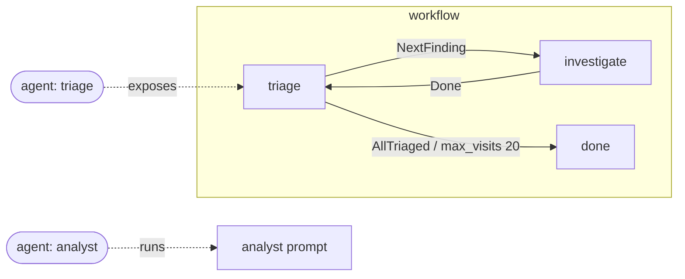

# RFC 0011: Workflow States as Agents

- **Status:** Draft
- **Author(s):** Charlie Holland (chaholl)
- **Created:** 2026-06-13
- **Updated:** 2026-06-13
- **Related Issues:** N/A

## Summary

Allow an agent (RFC 0007) to be backed by a **workflow state** instead of a single prompt. This adds one optional field, `state`, to `AgentDef`. When set, invoking the agent runs the pack's workflow starting at the named state — following its transitions, loops, and terminal states — rather than executing a single prompt once. The pack still has exactly one `workflow`; this change does not introduce additional workflows or any new top-level structure. It is fully backward compatible: an `AgentDef` without `state` behaves exactly as in RFC 0007.

## Motivation

RFC 0007 maps each agent to a single prompt: the `entry` and `members` keys reference prompt keys, and invoking an agent runs that prompt once. RFC 0005 / 0009 give a pack a workflow — a state machine over prompts, with event-driven transitions and bounded loops.

These two work in isolation but not together. A pack can describe a stateful, looping behavior in its workflow, but it cannot **expose that behavior as an agent**. The only thing an agent can be is a one-shot prompt. So a specialist whose job is genuinely iterative — a researcher that searches and refines until coverage is sufficient, a triage agent that loops over findings — has to be flattened into a single prompt, discarding the workflow that already describes it correctly.

The fix is small: let an agent point at a workflow state. The pack's single workflow already holds the states and loops; an agent that references a looping state simply runs that loop when invoked.

### Goals

- Let an agent be backed by a workflow state rather than only a prompt.
- Reuse the pack's existing single `workflow` (RFC 0005 / 0009) unchanged.
- Keep the change to one optional field on `AgentDef`.
- Maintain full backward compatibility with RFC 0007 agents.

### Non-Goals

- Introduce multiple workflows per pack. A pack still has exactly one `workflow`.
- Change workflow execution, loop, artifact, or budget semantics (RFC 0005 / 0009 unchanged).
- Change how agents delegate to one another — tool-reference delegation (RFC 0007 §How Agent Discovery Works) is unchanged.
- Change Agent Card derivation beyond sourcing it through the referenced state's prompt.

## Detailed Design

### Schema Changes

One new optional property on `AgentDef` (RFC 0007):

```json
{
  "AgentDef": {
    "properties": {
      "state": {
        "type": "string",
        "description": "Reference to a state key in the pack's `workflow.states`. When set, invoking this agent runs the pack workflow starting at the named state (following its transitions and loops) instead of executing the member-key prompt once. Requires a top-level `workflow`. If omitted, the agent is a single-prompt agent, exactly as in RFC 0007."
      }
    }
  }
}
```

The existing `AgentDef` properties (`description`, `tags`, `input_modes`, `output_modes`) are unchanged.

### Behavior

- **`state` omitted (default).** The agent runs the member-key prompt once. Identical to RFC 0007.
- **`state` set.** Invoking the agent enters the pack's single `workflow` at the named state. The agent's response is the result of executing that state and any transitions it triggers, up to a terminal state or budget exhaustion (RFC 0009). The workflow is the one already defined at the top level; the `state` field only selects the entry point for this agent.

The member key continues to source Agent Card metadata (`name`, `description`, `version`) per RFC 0007 §How Agent Discovery Works. For a state-backed agent, the member key's prompt is typically the same prompt the referenced state names in its `prompt_task`.

### Specification Impact

- **Amendment to `AgentDef` (RFC 0007):** one new optional property, `state`. Strictly additive.
- **`workflow`, `WorkflowState`, `WorkflowConfig` (RFC 0005 / 0009):** untouched.
- **All other definitions:** untouched.
- Packs without `AgentDef.state` are unaffected.

### Validation Rules

1. **State reference resolution.** Every `AgentDef.state` value MUST reference a key in the pack's `workflow.states`.
2. **Workflow required.** An `AgentDef.state` is only valid when the pack declares a top-level `workflow`. Using `state` without a workflow is an error.
3. **Member key validation (unchanged from RFC 0007).** Member keys and `entry` MUST reference keys in `prompts`.
4. **Backward compatibility.** The `state` field is optional. Agents without it remain valid and behave identically to RFC 0007.

## Examples

> YAML shown for readability (per [RFC 0002](./0002-yaml-format.md)). Equally valid as JSON.

### Example 1: Exposing a looping workflow state as an agent

A triage agent loops over findings (a cycle in the single workflow); an analyst agent is a plain prompt.

The `triage` agent is backed by a workflow state (it runs the loop); the `analyst` agent is a plain prompt, outside the workflow:



```yaml
id: security-review
name: Security Review Team
version: 1.0.0
template_engine:
  version: v1
  syntax: "{{variable}}"

prompts:
  triage:        { id: triage,        name: Triage,        version: 1.0.0, system_template: "..." }
  investigator:  { id: investigator,  name: Investigator,  version: 1.0.0, system_template: "..." }
  analyst:       { id: analyst,       name: Analyst,       version: 1.0.0, system_template: "..." }

workflow:
  version: 2
  entry: triage
  states:
    triage:
      prompt_task: triage
      max_visits: 20
      on_event:
        NextFinding: investigate
        AllTriaged: done
    investigate:
      prompt_task: investigator
      on_event:
        Done: triage
    done:
      prompt_task: triage
      terminal: true

agents:
  entry: triage
  members:
    triage:
      state: triage        # this agent runs the triage→investigate loop
      tags: [triage, security]
    analyst:               # plain prompt-backed agent, unchanged from RFC 0007
      tags: [analysis]
```

Invoking the `triage` agent runs the workflow loop; invoking `analyst` runs its prompt once.

### Example 2: Single-prompt agents only (unchanged)

An RFC 0007 pack with no `state` fields is unaffected:

```yaml
agents:
  entry: coordinator
  members:
    coordinator: {}
    researcher: { tags: [research] }
```

## Drawbacks

- **Member key vs state prompt.** A state-backed agent has both a member key (Agent Card source) and a referenced state (which names its own `prompt_task`). When these differ, a reader must understand that the card comes from the member key while execution starts at the state. Mitigation: in the common case they name the same prompt; documentation shows that idiom.
- **Coupling agents to workflow state names.** `AgentDef.state` ties the agents section to specific state keys, so renaming a state requires updating the agent. Mitigation: validation rule 1 catches dangling references.

## Alternatives

### Alternative 1: Multiple workflows per pack, one per agent

Add a `workflows` map and let each agent reference its own workflow.

**Rejected.** A pack has exactly one workflow; multiple workflows add top-level structure and binding rules for a problem that does not exist. A single workflow already holds every state and loop, and an agent only needs to name its entry state.

### Alternative 2: Let the member key itself resolve to a state name

Allow `entry` / member keys to reference either a prompt key or a workflow state name.

**Rejected.** Overloads the member-key namespace (which RFC 0007 defines as prompt keys, and which sources Agent Card metadata). A dedicated `state` field keeps the member key's meaning intact and makes the state binding explicit.

## Adoption Strategy

### Backward Compatibility

- [x] Fully backward compatible
- [ ] Requires migration
- [ ] Breaking change

The `state` field is optional. Every existing RFC 0007 pack remains valid and behaves identically.

### Migration Path

No migration required. Authors add `state` to an agent when they want it to run a workflow state instead of a single prompt.

### Runtime Support Levels

- **Level 0 (ignore):** Treat `state` as an unknown field; run the member-key prompt (RFC 0007 behavior).
- **Level 1 (validate):** Schema-validate `state` and its reference into `workflow.states`.
- **Level 2 (execute):** Invoke a state-backed agent by entering the pack workflow at the named state.

## Unresolved Questions

1. **Must the member-key prompt equal the referenced state's `prompt_task`?** The draft allows them to differ (member key sources the card, state names the entry prompt). Should the spec require them to match for clarity, or keep the flexibility?

## Testing Strategy

### Validation Tests

- An agent with `state` referencing a valid `workflow.states` key validates.
- An agent with `state` referencing a non-existent state fails validation.
- An agent with `state` in a pack that has no `workflow` fails validation.

### Compatibility Tests

- An RFC 0007 pack with no `state` fields loads and executes identically with this RFC applied.
- A Level-0 runtime ignoring `state` runs the member-key prompt as before.

## Documentation Impact

- [ ] Document `AgentDef.state` in the agents reference, with the looping-state example
- [ ] Note in the workflow docs that a state can be exposed as an agent
- [ ] Update `promptpack.schema.json` with the new property

---

## Revision History

- **2026-06-13:** Initial draft.

## References

- [RFC 0002: YAML Format](./0002-yaml-format.md)
- [RFC 0005: Workflow Specification Extension](./0005-workflow-extension.md)
- [RFC 0007: Agents Extension](./0007-agents-extension.md)
- [RFC 0009: Agent Loop Extension](./0009-agent-loops.md)
