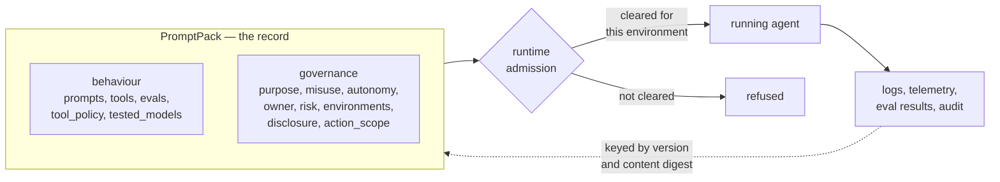

# RFC 0013: Governance Declarations

- **Status:** Draft
- **Author(s):** Charlie Holland (chaholl)
- **Created:** 2026-08-28
- **Updated:** 2026-08-28
- **Related Issues:** N/A

## Summary

Extend a pack so it records the governance facts about an agent alongside the behaviour it already describes: what the agent is for, what it must not be used for, how far it acts without a human, who is accountable for it, how it has been classified, which environments it is cleared to run in, and whether it must disclose that it is an AI. A companion field on each tool, `action_scope`, records what that tool can affect — whether it changes state, whether the change can be undone, and what class of data it touches.

The point is a single artifact. A pack already carries the model, the instructions, the tools, the guardrails, the eval definitions and the test evidence; adding the governance facts makes it the authoritative, versioned record of everything that constitutes an agent, which logs, telemetry and audit can key back to by version and content digest.

Two consequences follow that the schema alone does not deliver. A runtime can make admission decisions from declarations rather than from out-of-band configuration — refusing a pack cleared only for staging when it is deployed to production. And a policy can act on consequence rather than on tool names: "approve anything irreversible" stays correct when the next irreversible tool is added.

## Motivation

A pack describes **capability** in detail and **consequence** not at all.

It carries the model (`model_overrides`, `parameters`), the instructions (`system_template`, `fragments`, `variables`), the tools (`tools`), the guardrails (`validators`, `tool_policy.blocklist`), the autonomy budget (`tool_policy.max_rounds`, `max_tool_calls_per_turn`), the modality (`media`), the test evidence (`tested_models` — per-model success rate with a date), the eval definitions (`evals`), and the version history (`version`, `metadata.changelog`).

It cannot say what any of that is for, what it must not be used for, who answers for it, or what happens when a tool actually runs. `description` is prose written to help a human browse. `metadata.domain` is a discovery tag, routinely a development label rather than a statement about where the agent is meant to operate.

Those facts exist. They live in wikis, spreadsheets, ticket fields and registries — none of which are versioned with the content they describe, and all of which drift from it. An agent is then documented in one place and defined in another, and the two disagree the first time either changes.

Four things break as a result.

1. **Policy has to enumerate names.** A rule as ordinary as "stop and ask a human before anything that cannot be undone" must be written as a list of tool names, because nothing says which tools those are. The list is correct the day it is written and silently wrong the next time an irreversible tool is added.

2. **Every refusal looks alike in telemetry.** A dismissed file read and a blocked payment are the same event to a counter that knows only tool names. Aggregate tool-call statistics carry no signal about consequence.

3. **Deployment is unguarded.** Nothing in a pack says which environments it has been cleared for, so nothing can stop a pack built and reviewed for staging from being deployed against production data. The check exists only in whatever discipline surrounds the pipeline.

4. **Audit has no anchor.** Logs, eval results and tool-call records can be tied to a pack version and digest, but that version resolves to behaviour only. The governance context an auditor needs sits in a separate system with its own history, and reconstructing what was true at the time of an incident means reconciling two timelines.

This RFC closes the gap at the two levels where the answers are actually known: the pack as a whole, and the individual tool.

### Formalising what was already possible

Almost none of this was previously impossible. `metadata` accepts arbitrary properties, so a pack author could already write purpose, owner, risk or environment into a pack and have a runtime read them back. Several presumably have.

What was missing is agreement. A field only one author writes and only one runtime reads is a private convention: it cannot be validated, a second author spells it differently, and no tool that did not grow up alongside it can act on it. Governance is where that hurts most, because the consumer is frequently *not* the author — an auditor, a procurement reviewer, a registry, a runtime deciding whether to admit the pack at all.

Responsible-AI obligations are also close to universal now. They are not a vertical concern that a handful of packs carry and the rest can ignore, which is the case where a convention is the right answer and a specification is over-reach. When every serious deployment needs the same handful of facts, leaving each author to invent them produces a dozen incompatible spellings of the same idea and no interoperability at all.

So this RFC is an instance of the promotion path it describes for `extensions`: a need common enough across independent authors that agreeing the spelling is worth more than the flexibility of leaving it open. The fields are named and closed for exactly that reason, and the `extensions` bags remain for what has not yet earned it.

One note on why the pack rather than the runtime. PromptPack is an open specification, and a pack is executed by runtimes its author did not choose. A governance record that lives in one runtime's configuration is not a record of the agent; it is a record of that deployment.

### Goals

- Make the pack the authoritative, versioned record of an agent's governance facts as well as its behaviour.
- Let a tool declare what it affects, in terms a policy expression can rely on.
- Give a runtime enough to make admission decisions — environment, risk, autonomy — from the artifact itself.
- Reuse an existing maintained vocabulary for open-ended values instead of inventing legal taxonomy.
- Give every declaration an extension point, so tooling can annotate packs without waiting for a spec revision.
- Stay fully backward compatible.

### Non-Goals

- **Provenance and attestation are deferred.** Who declared a value, when, against which framework, and under what review is a substantial design of its own and belongs in a separate RFC. This one records the values; it does not evidence them. See [Future Considerations](#provenance-and-attestation).
- **Not a compliance schema.** This RFC models no regulation, and declaring these fields makes nothing compliant with anything.
- **Not an export format.** Emitting a bill of materials or a technical-documentation record operates on a deployed system. See [Related formats](#related-formats).
- **Does not prescribe enforcement mechanisms.** A runtime that claims to enforce a constraint must honour it (see [Runtime Support Levels](#runtime-support-levels)), but how — refusal at load or at call, hard block or operator override, and the error surface — is the runtime's to choose.
- No change to `tool_policy`, `validators`, `evals`, `workflow`, or any existing execution semantics.

## Detailed Design

### What the pack is the record of

The pack is the description of the agent. Everything that is true of the agent by design — what it does, what it is for, what it may affect, what it is cleared for, who answers for it — is recorded in it and versioned with it.

Two kinds of fact stay outside, and only two:

- **Identity bindings.** The pack declares that irreversible actions require approval. It does not name the individual who approves. A named person in a versioned artifact is stale the day they change team, and the pack would need a new version to record a fact about the agent that has not changed.
- **Per-interface resolution.** The pack declares that the agent must disclose it is an AI. It does not decide which of a runtime's interfaces face a human — one runtime commonly serves several at once, and that mapping is the runtime's to make. The requirement is the pack's; the resolution is not.

In both cases the pack remains authoritative for the *policy*. What sits outside is the binding of that policy to a particular deployment's people and interfaces.



### Declared intent, not enforced configuration

Every field here is a statement about the agent as designed. None of them configures anything.

`autonomy_level: acts_with_approval` says the pack was built and tested to act only with a human gate. It does not create the gate. `requires_ai_disclosure: true` says the agent must tell people it is an AI. It does not emit the disclosure. `approved_environments` says where the agent has been cleared to run. It does not deploy it.

The distinction matters because it is what keeps a declaration honest across deployments. Enforcement lives in `tool_policy`, in runtime policy, and in the deployment pipeline; those can be stricter than the pack asks, and the pack still describes the agent correctly. A runtime that ignores every field in this RFC still executes the pack identically.

It also sets the correctness bar. These fields are asserted by people, and a runtime that treats `risk_classification` as something it computed rather than something it was told will be wrong in a way that matters.

### Schema changes

Three additions, all optional.

**1. `metadata.governance`** — a closed object inside the existing open `metadata`:

```json
{
  "governance": {
    "type": "object",
    "description": "Governance facts about the agent this pack defines. Human-declared: a conforming implementation MUST NOT infer these values.",
    "additionalProperties": false,
    "properties": {
      "vocabularies": {
        "type": "object",
        "description": "Prefix to IRI map for CURIE values used in this block. Well-known prefixes have documented defaults and need not be declared.",
        "additionalProperties": { "type": "string", "format": "uri" }
      },
      "intended_purpose": {
        "type": "string",
        "description": "What the agent is built to do, stated by its author. Free text."
      },
      "foreseeable_misuse": {
        "type": "array",
        "description": "Uses the author considers out of bounds and reasonably foreseeable.",
        "items": { "type": "string" }
      },
      "autonomy_level": {
        "type": "string",
        "description": "How far the agent acts without a human in the loop, as designed and tested.",
        "enum": ["suggests", "acts_with_approval", "acts_with_oversight", "acts_autonomously"]
      },
      "accountable_owner": {
        "type": "string",
        "description": "The role, team or function answerable for this agent. Prefer a durable identifier over a named individual.",
        "examples": ["payments-risk", "Head of Customer Operations"]
      },
      "operator_role": {
        "type": "string",
        "description": "The declaring organisation's role for this agent, as a vocabulary term or free string.",
        "examples": ["eu-aiact:AIProvider", "eu-aiact:AIDeployer"]
      },
      "risk_classification": {
        "type": "string",
        "description": "The risk classification assigned to this agent, as a vocabulary term or free string. A namespaced term carries both the framework and the value, so no separate framework field is needed; a second classification under another framework belongs in extensions.",
        "examples": ["eu-aiact:HighRiskAI"]
      },
      "intended_deployment_contexts": {
        "type": "array",
        "description": "Sectors or settings the agent is built for, as vocabulary terms or free strings. Distinct from metadata.domain, which is a discovery tag.",
        "items": { "type": "string" }
      },
      "approved_environments": {
        "type": "array",
        "description": "Environments this pack has been cleared to run in. Open strings, because environment names are organisation-specific.",
        "items": { "type": "string" },
        "examples": [["staging"], ["staging", "production"]]
      },
      "requires_ai_disclosure": {
        "type": "boolean",
        "description": "Whether the agent must disclose that it is an AI to the people interacting with it. The runtime decides which of its interfaces this applies to."
      },
      "extensions": {
        "type": "object",
        "description": "Opaque annotations for external tooling. Never interpreted by this specification. Keys SHOULD be namespaced.",
        "additionalProperties": true
      }
    }
  }
}
```

`autonomy_level` values:

| Value | Meaning |
|---|---|
| `suggests` | Produces output. A human performs any action. |
| `acts_with_approval` | Acts, but each consequential action is approved by a human first. |
| `acts_with_oversight` | Acts on its own. A human monitors and can intervene or reverse. |
| `acts_autonomously` | Acts without a human in the loop. |

The split between `acts_with_approval` and `acts_with_oversight` is the difference between a human gate before the fact and a human check after it.

That is not an arbitrary place to divide the scale. The EU AI Act defines no autonomy taxonomy — it describes systems as operating with "varying levels of autonomy" and never enumerates them, requiring instead that oversight be "commensurate with the risks, level of autonomy and context of use". What it does specify is oversight *capability*, and it draws exactly this line. Article 14(4) requires, for high-risk systems generally, that a human be able to monitor for anomalies, correctly interpret output, "disregard, override or reverse the output", and stop the system — capabilities that must exist, with no mandatory gate before each action. Article 14(5) imposes a gate in one narrow case: for remote biometric identification, no action may be taken unless separately verified by at least two natural persons.

So `acts_with_oversight` is the 14(4) shape — intervention available, not required, which is what optional approval means — and `acts_with_approval` is the 14(5) shape. The specification borrows the distinction, not the legal thresholds.

**2. `Tool.action_scope` and `Tool.extensions`** — two properties on `$defs.Tool`:

```json
{
  "action_scope": {
    "type": "object",
    "description": "What this tool can affect. Describes consequence; does not gate anything. Absence means undeclared, not safe.",
    "additionalProperties": false,
    "properties": {
      "effect": {
        "type": "string",
        "description": "read: retrieves, changes nothing. write: changes state the operator controls. external: causes an effect outside the operator's systems (implies write).",
        "enum": ["read", "write", "external"]
      },
      "reversibility": {
        "type": "string",
        "description": "reversible: the prior state can be restored. compensable: it cannot, but a defined compensating action limits the harm. irreversible: nothing restores the state and nothing compensates. Declare against the world, not the API.",
        "enum": ["reversible", "compensable", "irreversible"]
      },
      "data_classes": {
        "type": "array",
        "description": "Classes of data the tool touches, as vocabulary terms or free strings.",
        "items": { "type": "string" }
      },
      "extensions": {
        "type": "object",
        "description": "Opaque annotations for external tooling. Never interpreted by this specification. Keys SHOULD be namespaced.",
        "additionalProperties": true
      }
    }
  }
}
```

`extensions` sits beside it, on the tool rather than inside `action_scope`:

```json
{
  "extensions": {
    "type": "object",
    "description": "Opaque annotations about this tool. Never interpreted by this specification. Keys SHOULD be namespaced.",
    "additionalProperties": true
  }
}
```

Two bags on one entity needs one rule to keep authors from guessing:
**`action_scope.extensions`** is for annotations about *consequence* — a blast radius, a severity score, anything that qualifies what the tool affects. **`Tool.extensions`** is for everything else about the tool, including the hints a runtime needs to implement its own policy (`acme.example/approval-threshold: 10000`).

That second bag exists because of how `autonomy_level` is enforced. The pack states that the agent acts only with approval; the runtime decides which calls that bites on, and a tool policy over `action_scope` is the obvious mechanism. Where a runtime needs something the closed fields do not carry, it goes here rather than into the specification. Per-tool oversight is deliberately *not* a field: it would be derivable from a policy over `effect`, `reversibility` and `data_classes`, and a declaration that restates what another field already implies is indirection, not information.

The cost is that extension keys do not interoperate — two runtimes will spell the same hint differently, and no cross-runtime tooling can act on them. That is also the promotion path: a namespaced key appearing across independent authors with consistent meaning is the evidence a future RFC needs. See [Promotion from `extensions`](#promotion-from-extensions).

**3. `AgentDef.governance`** — the same shape as `metadata.governance`, overriding it for one agent (RFC 0007).

### Why some values are closed and others open

`autonomy_level`, `effect` and `reversibility` are closed enums because their whole value is that a policy expression can depend on them. "Approve anything irreversible" is durable only if `irreversible` means one thing across packs from different authors. Anything richer — magnitude, blast radius, an organisation's own severity scale — goes in `extensions` until a future RFC has evidence to promote it.

`risk_classification`, `intended_deployment_contexts`, `data_classes` and `operator_role` are open because their content is legal and sectoral taxonomy that PromptPack has no business maintaining and no ability to keep current. `approved_environments` and `accountable_owner` are open because they name things only the declaring organisation can name.

### Vocabulary terms

Open-list values are **terms**, expressed as a CURIE (`eu-aiact:AIDeployer`) or an absolute IRI. `vocabularies` maps prefixes to namespace IRIs. These prefixes are well-known defaults and need not be declared:

| Prefix | Namespace |
|---|---|
| `dpv` | `https://w3id.org/dpv#` |
| `eu-aiact` | `https://w3id.org/dpv/legal/eu/aiact#` |
| `ai` | `https://w3id.org/dpv/ai#` |

DPV is **recommended, never required**. A value that is not a CURIE is a free string and remains valid. The specification does not resolve, dereference or validate terms against any vocabulary — the prefix map exists so a consumer can, if it wants to.

This is a deliberate hedge. DPV's `eu-aiact` extension is a Community Group Report, not a standards-track document, and it does not track legislative amendment quickly. Binding the schema to it would be a mistake. Referencing it, with the mapping declared inside the pack, is not: if the vocabulary moves or is replaced, packs change one URL and the schema is untouched.

### Override semantics

`AgentDef.governance` overrides `metadata.governance` by **per-field replacement**. A field present on the agent replaces the pack value for that field; a field absent inherits. Arrays and `extensions` replace whole — there is no element-wise or key-wise merge.

Predictability over expressiveness: deep-merging `foreseeable_misuse` across two levels would produce a list no one wrote, which is the wrong property for a declaration whose purpose is to state what a human intended.

### Absence is not a safe default

An omitted field means **undeclared**. An omitted `action_scope` does not mean `read`, and does not mean `reversible`. An omitted `approved_environments` does not mean "cleared everywhere", and equally does not mean "cleared nowhere".

How undeclared is treated when a value is used to gate something is a runtime decision. The same undeclared tool may warrant fail-closed in a regulated deployment and fail-open on a developer's machine. Runtimes that gate on these fields SHOULD treat undeclared as the most conservative class they support, and MUST document the choice.

### Runtime Support Levels

- **Level 0 — Ignore.** A runtime may ignore both blocks entirely. Packs carrying them remain valid and execute identically. Correct for any runtime that does not surface governance information.
- **Level 1 — Validate and surface.** Validate structure and enum values, reject unknown enum members, and make declarations available to tooling — listings, registries, agent cards, documentation generators, audit exports. No effect on execution.
- **Level 2 — Enforce.** Act on the declarations. A Level 2 runtime MUST declare which constraints it enforces, MUST NOT execute in a way that contradicts one it has declared, and MUST document how it treats undeclared values. The enforceable constraints are:
  - **`approved_environments`.** Do not run the pack in an environment it does not list.
  - **`autonomy_level`.** Do not take a consequential action without the oversight the level implies, using each tool's `action_scope` to decide which calls are consequential and binding the approver from deployment configuration.
  - **`requires_ai_disclosure`.** Do not face a human without disclosing, on whichever of its interfaces do so.

  A Level 2 runtime MAY additionally label tool-call metrics and audit records by `action_scope`, so consequence is visible in aggregate. That is reporting, not a constraint.

Partial support is conformant: a runtime may enforce `approved_environments` and not `autonomy_level`. What it may not do is claim a constraint and then contradict it. The specification does not prescribe the mechanism — refusal at load or at call, hard block or operator override, and the error surface, are all runtime choices.

**Not every field is a constraint.** `intended_purpose`, `foreseeable_misuse`, `accountable_owner`, `operator_role`, `risk_classification` and `intended_deployment_contexts` are records: there is nothing for a runtime to contradict, only to carry and surface. `action_scope` is neither — it is the input the constraints above are evaluated against.

### Specification impact

- **`metadata`** — one new optional property, `governance`. `metadata` remains `additionalProperties: true`; only the `governance` sub-object is closed.
- **`$defs.Tool`** — two new optional properties, `action_scope` and `extensions`. `Tool` is `additionalProperties: false`, so the schema change must land before packs validate.
- **`$defs.AgentDef`** (RFC 0007) — one new optional property, `governance`.
- Everything else is untouched. No existing field changes meaning.

### Validation rules

1. `autonomy_level`, `action_scope.effect` and `action_scope.reversibility` MUST be one of their enumerated values. Unknown values are an error, not a warning.
2. `metadata.governance`, `AgentDef.governance` and `action_scope` are closed objects: unknown properties are an error. Unrecognised information belongs in `extensions`.
3. Every `extensions` object — on `governance`, on `action_scope`, and on a tool — accepts any JSON object. Its contents MUST NOT be validated or interpreted by a conforming implementation.
4. `vocabularies` values MUST be absolute IRIs; keys MUST be valid CURIE prefixes.
5. A value containing a colon is treated as a CURIE. If its prefix is neither declared in `vocabularies` nor a well-known default, a validator SHOULD warn and MUST NOT error — free strings remain valid values.
6. Every field in `governance` is human-declared. A conforming implementation MUST NOT infer, compute or default these values from other pack content, and MUST NOT present a value it generated as if it had been declared.
7. `AgentDef.governance` follows per-field replacement over `metadata.governance`.
8. Every field in this RFC is optional. A pack declaring none of them is valid and unchanged.

## Examples

> YAML shown for readability (per [RFC 0002](./0002-yaml-format.md)). Equally valid as JSON.

### Example 1: Basic usage

A support pack that answers questions and raises disputes, with one tool that moves money.

```yaml
id: card-support
name: Cardholder Support
version: 2.1.0
template_engine:
  version: v1
  syntax: "{{variable}}"

metadata:
  domain: finance
  governance:
    intended_purpose: >
      Answers cardholder questions about settled transactions and raises
      disputes on the cardholder's explicit instruction.
    foreseeable_misuse:
      - Credit, pricing or eligibility decisioning
      - Adjudicating a dispute without a human reviewer
    autonomy_level: acts_with_approval
    accountable_owner: payments-risk
    operator_role: eu-aiact:AIDeployer
    approved_environments: [staging, production]
    requires_ai_disclosure: true

prompts:
  support:
    id: support
    name: Support
    version: 2.1.0
    system_template: "..."
    tools: [lookup_transaction, issue_refund]

tools:
  lookup_transaction:
    description: Look up a settled transaction by reference
    action_scope:
      effect: read
      data_classes: [dpv:FinancialData]
  issue_refund:
    description: Issue a refund against a settled transaction
    action_scope:
      effect: external
      reversibility: compensable
      data_classes: [dpv:FinancialData]
```

`autonomy_level: acts_with_approval` states that the agent acts only behind a human gate, and `action_scope` says which calls that bites on: `issue_refund` is external and only compensable, `lookup_transaction` changes nothing. Neither statement names the other, and both stay correct when the next tool is added. A dismissed read is also no longer indistinguishable from a blocked payment in telemetry.

### Example 2: Admission control and a per-agent override

A pack cleared only for staging, exposing two agents with different autonomy.

```yaml
metadata:
  governance:
    vocabularies:
      acme: https://acme.example/vocab#
    intended_purpose: >
      Triages inbound security findings and drafts remediation plans.
    foreseeable_misuse:
      - Automated remediation in production without review
    autonomy_level: acts_with_oversight
    accountable_owner: platform-security
    operator_role: eu-aiact:AIProvider
    risk_classification: eu-aiact:HighRiskAI
    intended_deployment_contexts: [eu-aiact:CriticalInfrastructure]
    approved_environments: [staging]
    extensions:
      acme.example/control-set: SOC2-CC7

agents:
  entry: triage
  members:
    triage: {}
    remediator:
      description: Applies an approved remediation plan
      governance:
        autonomy_level: acts_with_approval
        foreseeable_misuse:
          - Applying a plan that no reviewer approved

tools:
  apply_patch:
    description: Apply an approved remediation patch to a host
    action_scope:
      effect: external
      reversibility: irreversible
      data_classes: [acme:InfrastructureState]
      extensions:
        acme.example/blast-radius: fleet
    extensions:
      acme.example/approver-group: platform-security-oncall
```

A Level 2 runtime enforcing `approved_environments` refuses this pack in production: it lists `staging` only. The same runtime in staging admits it, and — enforcing `autonomy_level` — gates `apply_patch` on a human, because its `action_scope` says the change is irreversible. Nothing in the pack told it to gate that specific tool; it applied its own policy to the declared consequence. The two `extensions` keys are invisible to the specification and available to whichever runtime wrote them.

The `remediator` agent inherits everything except `autonomy_level` and `foreseeable_misuse`, which it replaces wholesale.

## Related formats

Non-normative, and included to make the boundary explicit rather than to create an obligation.

Two machine-readable inventory formats are relevant to anyone assembling a record of a deployed system: the OWASP **CycloneDX ML-BOM** (v1.7, standardised as ECMA-424, 2nd edition) and the **SPDX 3.0 AI Profile**. Both describe a deployed system — weights, datasets, dependencies — which a pack does not know. **Emitting either is an export concern and deliberately not a pack concern.**

The mapping below exists so an exporter is a transform rather than an interpretation:

| PromptPack | DPV | CycloneDX `modelCard` |
|---|---|---|
| `governance.intended_purpose` | `eu-aiact:IntendedPurpose` | `considerations.useCases` |
| `governance.foreseeable_misuse` | `eu-aiact:ReasonablyForeseeableMisuse` | nearest is `considerations.ethicalConsiderations`; no exact equivalent |
| `governance.operator_role` | `eu-aiact:AIProvider` / `AIDeployer` | no equivalent |
| `governance.risk_classification` | `eu-aiact` risk terms | no equivalent |
| `governance.autonomy_level` | no equivalent | no equivalent |
| `governance.approved_environments` | no equivalent | no equivalent |
| `tool.action_scope` | no equivalent | no equivalent |
| existing `tested_models` | — | `quantitativeAnalysis.performanceMetrics` |

The gaps are informative. Model cards describe a model; the AI Act vocabulary describes a system in a legal context. Neither describes **what an agent may do with a tool, or where it is cleared to run** — the layer a prompt pack is uniquely positioned to record, and the reason `autonomy_level`, `approved_environments`, `effect` and `reversibility` are defined here rather than borrowed.

## Drawbacks

- **Declarations are unverified.** Nothing checks that a tool marked `reversible` can be reversed, that `risk_classification` reflects a real assessment, or that anyone reviewed `approved_environments`. These are assertions, exactly as `description` is today. Without provenance the pack records *what was claimed*, not *that the claim was made responsibly* — which is precisely the gap the deferred provenance RFC has to close, and until it does, a governance block is weaker evidence than it looks.
- **A field nobody fills in is worse than none.** Optional declarative fields have a poor track record. If `action_scope` is blank across an ecosystem, consumers learn to ignore it and the fields become noise that implies more assurance than exists. Mitigated by keeping the closed set small, making every field independently useful, and stating that absence means undeclared.
- **Admission control invites a false sense of safety.** A runtime refusing a staging pack in production is a useful guardrail and not a security boundary: the field is author-declared and trivially editable by anyone who can edit the pack. It catches mistakes, not adversaries, and should be documented that way.
- **Governance facts change on a different clock from behaviour.** An ownership change now bumps a pack version for content whose behaviour is identical, and CI that stamps per-environment values produces several artifacts from one source. Both are workable; neither is free.
- **A vocabulary dependency, however loose.** Recommending DPV creates a soft coupling to a Community Group deliverable. The prefix map confines the blast radius to one URL per pack, but the recommendation would need revisiting if DPV stalls.

## Alternatives

### Alternative 1: A new top-level `governance` block

Make governance a sibling of `metadata` and `compilation` rather than nesting it inside `metadata`.

Rejected. The house preference is to extend an existing surface rather than add a top-level primitive, and nesting costs nothing: the closed sub-object gets strict validation whether or not its parent is permissive. Nesting also has a useful side effect — because `metadata` is already `additionalProperties: true`, packs can begin writing `metadata.governance` against today's schema and simply become validated when the change lands.

### Alternative 2: Keep governance facts out of the pack entirely

Leave purpose, owner, risk and environment to the agent card, a registry or a deployment manifest, and keep the pack to behaviour.

Rejected, and this was an earlier draft of this RFC. It produces exactly the problem in the Motivation: the agent is defined in one artifact and described in another, the two are versioned separately, and reconstructing what was true during an incident means reconciling two timelines. It also makes admission control impossible — a runtime cannot refuse a staging pack in production if the pack does not say it is a staging pack. The registry view is still available to anyone who wants it, and is better fed from a pack that carries the facts than from a second system that has to be kept in step.

### Alternative 3: Free-form governance metadata only

Ship the `extensions` bag and no closed fields, letting conventions emerge.

Rejected. It defeats the purpose. The value of `reversibility` is that a policy expression can depend on it meaning one thing across packs from different authors; a convention emerging independently in three organisations produces three incompatible spellings. `extensions` is the right home for what is not yet agreed, not for what is.

### Alternative 4: Adopt DPV or CycloneDX wholesale

Model the governance block directly on `eu-aiact` terms, or embed a CycloneDX `modelCard` in the pack.

Rejected on both counts. DPV is an RDF vocabulary whose expressive model does not fit a closed JSON Schema. A `modelCard` describes a deployed model, including weights, datasets and dependencies a pack does not have. Referencing both — terms by CURIE, formats by a documented mapping — gets the interoperability without the coupling.

### Alternative 5: Put action scope in `tool_policy`

Express consequence as policy rules alongside `blocklist` and `max_rounds`.

Rejected. It inverts the relationship. Reversibility is a property of the tool, true wherever the tool is called; policy is the decision about what to do about it. Putting the property in the policy means restating it in every policy that mentions the tool, which is how the enumerate-the-names problem started.

## Adoption Strategy

Nothing to migrate. Every field is optional and additive; existing packs remain valid and behave identically.

Adoption is expected in stages, each useful alone:

1. **Tools first.** `action_scope` on tools that obviously warrant it — anything external or irreversible. Immediately useful for policy and telemetry, independent of any governance block.
2. **Purpose and autonomy.** `intended_purpose`, `foreseeable_misuse`, `autonomy_level`. Useful for registries and listings before any compliance consumer exists.
3. **Operational facts.** `accountable_owner` and `approved_environments` — the point at which admission control becomes possible.
4. **Legal classifications.** `operator_role`, `risk_classification`, `intended_deployment_contexts`, moved to vocabulary terms where a term exists. Free strings stay valid indefinitely.

Because `metadata` is already permissive, stage 2 can begin before the schema change ships; those packs become validated rather than newly valid.

### Backward Compatibility

- [x] Fully backward compatible
- [ ] Requires migration (describe migration path)
- [ ] Breaking change (describe impact and migration)

### Migration Path

Not applicable.

## Unresolved Questions

- **Is `approved_environments` enough on its own?** It answers "may this pack run here", which is the case that prompted it. It does not express staged promotion — that a pack cleared for staging is *a candidate for* production — which is how most pipelines actually work. Whether that belongs in the spec or in the pipeline is unresolved.
- **What does a runtime do with `risk_classification`?** Admission control on environments is unambiguous. "Refuse a pack whose classification exceeds what the deployment permits" assumes classifications are ordered, and a namespaced term from an arbitrary framework is not.
- **Should the Article 14(4) oversight affordances be declarable?** A pack states an `autonomy_level` but not whether a stop button exists or output can be reversed. Those are properties of the runtime and its interfaces, not of pack content, so a pack claiming them would be claiming something it cannot honour — but their absence means the record is incomplete on the point Article 14 cares most about.

Resolved during review, recorded here because the reasoning matters more than the outcome:

- **`requires_approval_for` was removed.** It named `action_scope` values that a pack-level rule would match against each tool. Because a tool's `action_scope` is fixed when the pack is written, the match resolves statically — it was always true or always false per tool, and so added indirection rather than information. `autonomy_level` states the requirement, `action_scope` states the facts, and the runtime composes them.
- **`risk_classification` is a single term, not an array.** A namespaced term already carries both framework and value; a second classification under another framework belongs in `extensions`.
- **`approved_environments` reserves no names, and `action_scope` gains no `magnitude` axis.** Both would have the specification inventing vocabulary that varies by organisation. `extensions` covers them.
- **How a runtime reports an admission refusal is out of scope.** The specification says which constraints must be honoured, not what a refusal looks like.

## Implementation Plan

1. **Phase 1: Schema**
   - [ ] Add `governance` to `metadata`, `action_scope` to `$defs.Tool`, `governance` to `$defs.AgentDef`
   - [ ] Bump schema `version` to the next minor
   - [ ] Update the README spec badge and versioned schema URL in lockstep

2. **Phase 2: Documentation**
   - [ ] Spec documentation for both blocks, including declared-intent-versus-enforcement and the two things that stay outside
   - [ ] Documented well-known prefix defaults
   - [ ] Docs version snapshot for the outgoing spec version

3. **Phase 3: Validation**
   - [ ] Enum and closed-object validation
   - [ ] CURIE prefix warning (warn, never error)
   - [ ] `AgentDef.governance` per-field replacement resolution

## Testing Strategy

### Validation Tests

- A pack with no governance fields validates unchanged.
- Each enum rejects an unknown member.
- An unknown property inside `governance` or `action_scope` is rejected; the same property inside `extensions` is accepted.
- `extensions` accepts arbitrarily nested JSON without interpretation.
- A CURIE with an undeclared, non-well-known prefix warns and validates.
- `AgentDef.governance` replaces per field and inherits the rest; arrays replace whole.

### Compatibility Tests

- Every existing example pack in the repository validates against the new schema unchanged.
- A pack carrying governance fields executes identically on a Level 0 runtime.

## Documentation Impact

- [ ] New spec section covering both declaration surfaces
- [ ] Runtime Support Levels documented, including the admission-control behaviour
- [ ] Well-known vocabulary prefixes documented
- [ ] Schema reference regenerated

## Future Considerations

### Provenance and attestation

Everything here is an assertion, and the pack does not record who made it, when, against which framework, or under what review. That is the difference between a governance record and governance evidence, and it is a design of its own: a shared declaration wrapper, signing, and a story for what a consumer does with an unattested claim. Deliberately deferred to its own RFC; the fields defined here are the values it would attest.

### Promotion from `extensions`

`extensions` is designed to be mined. If a namespaced key appears across independent authors with consistent meaning — `blast-radius` being the obvious candidate — that is the evidence a future RFC needs to promote it into the closed set. The bag is a staging area, not a permanent dumping ground.

### Verified rather than asserted declarations

A tool's `reversibility` could in principle be corroborated — by an eval that exercises the undo path, by a runtime observing compensating calls. Substantially larger than provenance, and noted only to mark the direction.

### Packs as inventory components

AI bill-of-materials tooling is beginning to track prompts alongside models and datasets. A pack carrying a version, a content digest and a declared purpose is a natural first-class component in such an inventory. Worth its own RFC if the tooling settles.

---

## Revision History

- **2026-08-28:** Initial draft

## References

- [RFC 0002: YAML File Format](./0002-yaml-format.md)
- [RFC 0007: Agents Extension](./0007-agents-extension.md)
- [RFC 0012: Provider Requirements](./0012-provider-requirements.md)
- [Data Privacy Vocabulary — EU AI Act extension](https://w3id.org/dpv/legal/eu/aiact) (W3C Community Group Report)
- [Data Privacy Vocabulary — AI extension](https://w3id.org/dpv/ai) (W3C Community Group Report)
- [OWASP CycloneDX ML-BOM](https://cyclonedx.org/capabilities/mlbom/)
- [ECMA-424 — CycloneDX Bill of Materials Specification](https://ecma-international.org/publications-and-standards/standards/ecma-424/)
- [SPDX 3.0 AI Profile](https://spdxai.github.io/)
