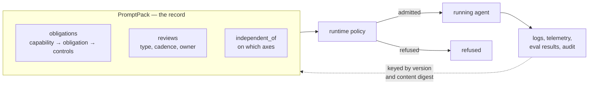

# RFC 0016: Governance Obligations, Vocabulary and Policy Annotation

- **Status:** Draft
- **Author(s):** Charlie Holland (chaholl)
- **Created:** 2026-08-31
- **Updated:** 2026-09-01
- **Discussion:** To be opened in the RFC Comments category
- **Related Issues:** N/A

## Summary

[RFC 0013](./0013-governance-declarations.md) records what an agent *is*: its purpose, its foreseeable misuse, how far it acts without a human, who is accountable for it, how it has been classified, where it is cleared to run, whether it must disclose that it is an AI, and — per tool — what that tool can affect. This RFC adds the facts a regulated reader asks for next, each of which is a statement about the agent that nothing else in the pack carries:

- **What obligations follow from a declared capability, and which controls satisfy them.** `capabilities` is a flat list of terms, so a declared capability is a label. `obligations` maps the label to the duty it triggers and to the controls that discharge it — naming the guardrail in this pack that enforces it and the eval that watches it.
- **Which obligations recur, on what cadence, owned by whom.** Nothing in RFC 0013 is time-based, and an agent validated once and never again is a live compliance failure invisible to a declaration that records only a state.
- **That a reviewing agent must be independent of what it reviews.** `independent_of` records that a review must not share a model, a provider, a tool set, its instructions — or its accountable owner — with whatever produced the thing being reviewed. Naming that last axis is how a pack expresses segregation of duties.

It also settles a question RFC 0013 left as a patchwork: **where a runtime policy may keep what it knows.** RFC 0013 added `extensions` to three definitions, chosen by what it happened to need. This RFC applies a rule instead — a definition gets `extensions` if a policy makes a decision at it — and adds the slot to the six that qualify and do not have one.

The RFC also extends RFC 0013's well-known prefix table so the terms these fields take have a shared spelling. That extension is overwhelmingly a matter of *pointing at* the Data Privacy Vocabulary, which since version 2.3 covers the great majority of the slots RFC 0013 opened. Two small namespaces are minted where nothing external supplies the terms.

Nothing here enforces anything. Consistent with RFC 0013, every field is a declaration; a runtime's policy decides how and where the agent runs. That division is what makes it possible to add these facts once and let arbitrary governance schemes arrive afterwards as vocabulary rather than as schema.

It is also why this RFC adds **no dedicated field for segregation of duties**, despite that being the control regulated readers ask about most. Separation of duties is about separating areas of responsibility, and RFC 0013 already records responsibility in `accountable_owner` — so the control is expressed by naming that axis in `independent_of`, checked by the runtime across two artifacts it resolved itself. The alternative of labelling tools by the duty they discharge was worked through and rejected; see [Alternative 1](#alternative-1-add-a-duty-field-to-action_scope).

## Motivation

### The pack is the record; the policy lives in the runtime

RFC 0013 established the shape this RFC follows: a pack states what is true of the agent by design, and a runtime decides what to do about it. A declaration that configures nothing can be read by an admission controller, a registry, an audit export, a linter and a reviewer alike, none of which need agree on anything but what the field means.

It is also the test this RFC applies to itself. A governance concern that reduces to *a fact about the agent* belongs in the pack; one that reduces to *a rule about which agents may run* belongs in the runtime and needs no schema. Most of what looks like missing governance schema is the second kind, and this RFC cut one of its own proposed fields on that ground.

### What RFC 0013 does not record

**Capabilities carry obligations, and the pack names only the capability.** RFC 0013 added `capabilities` precisely because some obligations attach to what an agent does regardless of where it is deployed — generating synthetic media, recognising emotion, categorising people biometrically. It stopped at the label. Which obligation a label triggers, and what discharges it, is knowledge that has to live somewhere; today it lives in a spreadsheet next to the pack.

**Nothing is time-based.** `risk_classification: eu-aiact:RiskLevelHigh` is as true of a pack tested last week as of one tested two years ago. The obligations that attach to a high-risk classification are mostly recurring — bias testing, accuracy review, post-market monitoring — and a declaration that records only a state cannot express one.

**A policy has nowhere to keep what it knows.** RFC 0013 gave `extensions` to `Governance`, `ActionScope` and `Tool`, which covers the objects that RFC needed and no others. Every other point at which a runtime decides something — invoking a model, gating a response, admitting a workflow transition, choosing which tools are reachable — is a closed object with nowhere to attach an annotation. That is not a governance problem specifically, but it is the same problem: the pack is where a policy's inputs live, and half the inputs have no home.

**Independence of review is not expressible.** Where one agent reviews another's output, the review is worthless if both share the model, the prompt and the context: the error that produced the output produces the approval. Nor is the stronger, organisational form — that the team answerable for a review is not the team answerable for what it reviews. RFC 0013 records `accountable_owner` on each agent but has no way to require that two of them differ.

### Why a single RFC

Governance vocabulary is unbounded, and RFC 0013 already solved that for *values*: open-list fields take CURIE terms, `vocabularies` maps prefixes to namespaces, and anything unrecognised goes in `extensions` with a promotion path. What is unsolved is *structure*. This RFC adds the few shapes governance actually needs — an obligation with controls, a recurring review, an independence requirement — and then closes the question. New regulations arrive as terms in those shapes; anything structurally new rides in `extensions` until evidence promotes it. The RFC holds itself to that rule.

### Goals

- Record what obligation a declared capability triggers, and which controls discharge it, with controls that resolve against pack content wherever possible.
- Record which obligations recur, on what cadence, and which team owns them.
- Record that a reviewing agent must be independent of what it reviews, and on which axes — including organisational independence, which is how segregation of duties is expressed.
- Give the terms these fields take a shared spelling, by referencing existing vocabularies rather than authoring new ones.
- Keep every addition a declaration. No field configures, enforces or gates anything.
- Give a runtime policy somewhere to keep its own metadata at every point it makes a decision, under a stated rule rather than case by case.
- Make the extension path explicit enough that the next governance scheme needs no RFC.

### Non-Goals

- **Not a compliance schema.** This RFC models no regulation, and declaring these fields makes nothing compliant with anything. Publishing a term is not interpreting the instrument it names.
- **No duty labels on tools.** The segregation-of-duties control is real and well grounded, and it is expressed through `independent_of` on `accountable_owner` plus the two-pack structure, not by labelling which tool authorises. See [Alternative 1](#alternative-1-add-a-duty-field-to-action_scope) and [Example 4](#example-4-financial-services-and-separation-of-duties).
- **No completion records.** The pack declares a cadence and an owner. Whether a review was actually performed, and when, is runtime state. See [Completion records stay out](#completion-records-stay-out).
- **No identity bindings.** RFC 0013 excludes these deliberately, and the exclusion holds: `owner` names a team or a role, never a person.
- **No enforcement mechanism.** A runtime that claims to enforce a constraint must honour it; how it does so is its own choice.
- **No execution isolation.** Isolated execution environments, memory segregation, authenticated inter-agent communication and rapid isolation of a compromised agent are infrastructure concerns — container, network and credential boundaries — with nothing to declare in a pack. See [Alternative 4](#alternative-4-specify-execution-isolation).
- **No changes to RFC 0013.** Every field it defines keeps its meaning. Nothing here is required for those fields to work.
- **No change to execution semantics.** One optional `id` on `Validator` lets a control name a guardrail, and six definitions gain an `extensions` slot. Nothing about how validators, evals, prompts, agents, `tool_policy`, `workflow` or `compositions` behave changes, and a conforming implementation MUST NOT interpret an `extensions` object at all.

## Detailed Design

### The division of labour



The pack carries facts; the operator writes the policy that acts on them. A pack does not know whether its operator separates authorisation from execution or treats an undeclared field as fail-closed — and putting those in the pack would mean every pack restating the same policy, and any pack able to opt out by omission.

One test runs throughout: *does this field carry information the runtime cannot derive from the pack?* It removed a field this RFC originally proposed — see [Alternative 1](#alternative-1-add-a-duty-field-to-action_scope).

### Schema changes

Three additions to `$defs.Governance`, all optional. No change to `$defs.ActionScope` or `$defs.Tool`.

```json
{
  "Governance": {
    "properties": {
      "independent_of": {
        "type": "object",
        "description": "Requires that whatever produces this agent's input does not share the listed properties with it. A deployment requirement resolved by the runtime, not a reference to another agent.",
        "additionalProperties": false,
        "required": ["on"],
        "properties": {
          "on": {
            "type": "array",
            "minItems": 1,
            "uniqueItems": true,
            "items": { "enum": ["model", "provider", "tools", "prompts", "accountable_owner"] }
          },
          "enforcement": {
            "type": "string",
            "enum": ["strict", "advisory"],
            "default": "advisory"
          }
        }
      },

      "obligations": {
        "type": "array",
        "description": "What obligations follow from this agent's declared capabilities, and which controls discharge them.",
        "items": {
          "type": "object",
          "additionalProperties": false,
          "required": ["id", "obligation", "controls"],
          "properties": {
            "id": { "type": "string" },
            "obligation": { "type": "string", "description": "Term: CURIE or absolute IRI." },
            "applies_to": {
              "type": "object",
              "additionalProperties": false,
              "properties": {
                "capability": { "type": "string" },
                "data_class": { "type": "string" },
                "risk_classification": { "type": "string" }
              }
            },
            "controls": {
              "type": "array",
              "minItems": 1,
              "items": {
                "type": "object",
                "additionalProperties": false,
                "minProperties": 1,
                "maxProperties": 1,
                "properties": {
                  "field": { "type": "string", "description": "Names a governance field that must be declared." },
                  "validator": { "type": "string", "description": "Names a validator id defined in this pack. Validators always enforce (RFC 0015)." },
                  "eval": { "type": "string", "description": "Names an eval id defined in this pack. Records that a measurement for this control exists; what acts on its score is runtime policy." },
                  "external": { "type": "string", "description": "A control outside the pack, described in prose." }
                }
              }
            },
            "note": { "type": "string" },
            "extensions": {
              "type": "object",
              "description": "Namespaced, uninterpreted. MUST NOT be validated by a conforming implementation."
            }
          }
        }
      },

      "reviews": {
        "type": "array",
        "description": "Obligations that recur. The pack declares cadence and owner; completion records are runtime state.",
        "items": {
          "type": "object",
          "additionalProperties": false,
          "required": ["id", "type", "cadence", "owner"],
          "properties": {
            "id": { "type": "string" },
            "type": { "type": "string", "description": "Term: CURIE or absolute IRI." },
            "cadence": {
              "type": "string",
              "description": "ISO 8601 duration, e.g. P3M for quarterly.",
              "pattern": "^P(?!$)(\\d+Y)?(\\d+M)?(\\d+W)?(\\d+D)?(T(?=\\d)(\\d+H)?(\\d+M)?(\\d+S)?)?$"
            },
            "owner": { "type": "string", "description": "A team or role. Never a named individual." },
            "satisfies": { "type": "array", "items": { "type": "string" } },
            "eval": { "type": "string" },
            "extensions": {
              "type": "object",
              "description": "Namespaced, uninterpreted. MUST NOT be validated by a conforming implementation."
            }
          }
        }
      }
    }
  },

  "Validator": {
    "properties": {
      "id": {
        "type": "string",
        "description": "Optional identifier, so a governance control can reference this validator. Unique across the pack where declared.",
        "pattern": "^[a-z][a-z0-9_-]*$"
      }
    }
  },

  "// Added identically to each def in the decision-point table below": {
    "extensions": {
      "type": "object",
      "description": "Opaque annotations about this object. Never interpreted by this specification. Keys SHOULD be namespaced.",
      "additionalProperties": true
    }
  }
}
```

### `independent_of`

Where one agent reviews another's output, the review is worthless if both share the model, the provider, the tool set and the instructions: the error that produced the output produces the approval. This is what SR 11-7 §IV means by *independent* review.

```yaml
metadata:
  governance:
    independent_of:
      on: [accountable_owner, model, provider, prompts]
      enforcement: strict
```

The pack states the requirement without naming the agent it must be independent *of* — that agent is generally in a different pack, and a pack-local reference could not resolve. The runtime knows the composition and resolves it, exactly as it resolves `requires_ai_disclosure` against whichever interfaces face a human. Naming the counterparty was rejected for the reason a list is always rejected here: it stops being correct when the topology changes, and fails silently when it does. An optional `of:` naming a pack id becomes worth revisiting only if a composition idiom emerges in which the producer is known at authoring time.

`on` is a closed enum because independence is a *comparison*, and an author-supplied axis would name something a runtime has no way to compare. `operator_role` is the obvious candidate for a sixth — an outsourced reviewer that must be a different legal entity, not merely a different team — and is left out until a deployment needs it.

| Axis | Resolves against | Buys |
|---|---|---|
| `model` | the effective model after `model_overrides` | technical independence — two agents sharing a model make the same mistake |
| `provider` | the effective provider | technical, plus insulation from one provider's outage or policy change |
| `tools` | the tool sets, independent when disjoint | technical — a shared tool is a shared blast radius |
| `prompts` | the prompt keys, independent when neither uses the other's | technical — shared instructions produce correlated judgement |
| `accountable_owner` | the `accountable_owner` of each | **organisational** — a different team is answerable for the review than for what it reviews |

:::caution[The technical axes are a quality control, not a security control]
They address correlated failure, not compromise: an attacker who has injected the drafting agent is not stopped by the approver running a different model. A pack that wants segregation of duties must name `accountable_owner` explicitly — the technical axes alone buy diversity of judgement, not separation of responsibility.
:::

**`accountable_owner` is why this RFC needs no duty labels.** RFC 0013 defines it as *"the role, team or function answerable for this agent"*, and separation of duties — [NIST SP 800-53 AC-5](https://csf.tools/reference/nist-sp-800-53/r5/ac/ac-5/), [ISO/IEC 27001:2022 Annex A 5.3](https://www.isms.online/iso-27001/annex-a-2022/5-3-segregation-of-duties-2022/) — is about separating areas of responsibility. Same subject. An approver declaring this axis says *whatever I approve must answer to a different team than I do*, and the runtime checks it by comparing two values it resolved itself rather than trusting a self-assessment. It is also a claim the approver *wants* to make, since it is what an operator binds an independent reviewer by.

It does not stop a pack that both approves and acts while declaring no approval requirement — there is no counterparty to compare against. Such a pack is declaring `acts_autonomously` or nothing at all, which is separately visible and gateable.

### Separation is structural

Tools are pack-scoped: `AgentStep.tools[]` subsets the pack's `tools`, and `agents.entry` may route to any member, so an injection's blast radius is the pack, not an agent. The remedy needs no schema — **two duties, two packs** — and is stronger than any within-pack field, because two packs means two digests, two accountable owners and two admission decisions. Separation becomes a property of the artifact rather than of a configuration.

RFC 0013 carries the rest: `autonomy_level: acts_with_approval` states that each consequential action is approved first, with the approver **bound from deployment configuration**. [Example 4](#example-4-financial-services-and-separation-of-duties) shows the whole arrangement, admission policy included, without a new field.

### `obligations`

```yaml
metadata:
  governance:
    capabilities: [ai:EmotionRecognition]
    requires_ai_disclosure: true
    obligations:
      - id: art50-disclosure
        obligation: eu-aiact:Article50
        applies_to: { capability: ai:EmotionRecognition }
        controls:
          - field: requires_ai_disclosure
          - eval: disclosure-present
          - external: Operator-side banner on the web channel
        note: Transparency duty in force since 2 August 2026.
```

Four control forms, exactly one key each:

| Form | Resolves against | Checkable | What it does at runtime |
|---|---|---|---|
| `field` | a property name in `governance` | Yes — the field must exist and be declared | Nothing. A declaration. |
| `validator` | an `id` in a prompt's `validators` | Yes — the validator must exist | **Enforces in the response path.** A triggered validator rewrites or blocks the message ([RFC 0015](./0015-deprecate-fail-on-violation.md)). |
| `eval` | an `id` in the pack's `evals` | Yes — the eval must exist | **Watches, and can act.** Scores every matching turn or session; the runtime decides what that drives — an alert, a page, a blocked deploy, a quarantined pack — outside the response path. |
| `external` | nothing | No — prose | Whatever the operator built. |

They are four kinds of claim, and an obligation is clearer for naming more than one: `validator` says *this is enforced in the response path*, `eval` says *this is watched continuously*, `field` says *this is declared*, `external` says *this is handled somewhere I cannot point at*. Most real obligations want at least the first two — one stops the anticipated case, the other notices the unanticipated one.

**`Validator.id` exists so the enforcing form has something to name.** Validators had no identifier before this RFC. The field is optional and additive, changes nothing about how validators run, and must be unique across the pack because every other reference here resolves pack-wide.

:::note[Validators are per-prompt; obligations are not]
`Prompt.validators` is the only declaration site, so an obligation stated at pack level names a guardrail attached to one prompt. Resolution is unambiguous, but it reads asymmetrically and a guardrail meant for every prompt must be repeated on each. A pack-level `validators` array would fix both and is the obvious follow-on — left out here because it carries precedence and override questions this RFC has no evidence for.
:::

**An eval needs no threshold and this RFC uses none.** Where the measurement is pass/fail its shape is `metric.type: boolean`; where it is a score, the score is the measurement and the judgement about it belongs to whatever consumes the metric. Putting a verdict inside the measurement would repeat, one layer down, the conflation [RFC 0015](./0015-deprecate-fail-on-violation.md) removed when it stopped validators being used as measurement.

Naming an eval does not say the obligation currently holds, and a reader must not take it that way. What it gives an auditor asking *"how would you know if this stopped being true?"* is a specific, named, versioned measurement carried by the same artifact, runnable against exactly what was deployed — which nothing outside the pack can offer, because nothing outside the pack is bound to the digest.

`applies_to` records what triggers the obligation. It is a record rather than a filter: a validator does not use it to decide whether the obligation applies, because that determination is a legal one.

Each entry carries an optional `extensions` object on the terms set out in [Policy annotation at decision points](#policy-annotation-at-decision-points) — a control-framework identifier, an internal risk rating, a link to the assessment behind the mapping.

### `reviews`

```yaml
metadata:
  governance:
    reviews:
      - id: quarterly-bias-test
        type: pp:BiasTesting
        cadence: P3M
        owner: fair-lending-team
        satisfies: [art22-human-review]
        eval: demographic-parity
        extensions:
          acme.example/review:
            method_ref: ACME-BIAS-004
            evidence_store: s3://acme-model-risk/bias/
            escalation: model-risk-committee
```

`reviews` is a sibling of `obligations` rather than nested inside it, because one review routinely satisfies several obligations and some answer to no declared obligation at all.

Each entry carries an optional `extensions` object, namespaced and uninterpreted, on the same terms as every other `extensions` in the specification. It matters more here than elsewhere, because a recurring review is the field most likely to need organisation-specific attachments — which method was used, where the evidence lives, who is escalated to when it lapses — and none of those belong in an open specification. A conforming implementation MUST NOT validate or interpret the contents.

:::caution[`extensions` is not a way to smuggle completion records back in]
The prohibition below is on the *fact*, not on the field that carries it. A `last_completed` date is stale-by-design inside a versioned artifact whether it sits in `reviews` or in `reviews[].extensions`. Runtimes SHOULD ignore any extension key that appears to record a completion, and MUST NOT treat one as evidence that an obligation is current.
:::

`owner` names a **team or a role**, never a person. RFC 0013 excludes identity bindings because a named individual in a versioned artifact is stale the day they change team, and the pack would need a new version to record a fact about the agent that has not changed. That reasoning applies unchanged here.

#### Completion records stay out

A `last_completed` date inside a versioned artifact goes stale by design, and recording one would force a new pack version to capture something that is not a change to the agent. The pack declares the cadence and the owner; the runtime holds completions.

The consequence is worth stating plainly rather than hiding: **the pack alone cannot answer "is this obligation current?"** It answers "how often is this supposed to happen, and who owns it", which is a question about the agent. Whether it actually happened is a question about a deployment.

The join between the two is the runtime's to make, but the key is not. A runtime that records completions SHOULD key them by `reviews[].id`, and an author SHOULD keep a review's `id` stable across pack versions for as long as the review means the same thing. Specifying only the key leaves runtimes free to store and expose completions however they like, while stopping two of them from inventing incompatible identifiers for the same recurring obligation — which is what would otherwise make the pack's ids a de facto interface nobody designed.

### Vocabulary

RFC 0013 established that open-list values are terms — a CURIE or an absolute IRI — with `vocabularies` mapping prefixes to namespaces, and that a small set of prefixes are well-known. This RFC extends that set, under a rule stated so it need not be re-argued:

> **Reference, do not author.** A prefix is added by pointing at an existing vocabulary. A term is minted under `promptpack.org` only where **no external vocabulary supplies it** *and* **the term is definitionally frozen in the instrument that defines it**.

The second condition carries the weight. A stale published vocabulary is worse than none, and RFC 0013 made these lists open precisely because legal taxonomy is content the specification has "no business maintaining and no ability to keep current". Minting terms that move would contradict that; minting terms that cannot does not.

The [Data Privacy Vocabulary](https://w3id.org/dpv) covers most of the slots RFC 0013 opened — 8,855 classes as of DPV 2.3 (25 February 2026), across a core vocabulary, a personal-data taxonomy, an AI extension, sector extensions and per-jurisdiction legal extensions.

#### Well-known prefixes

Added to the three RFC 0013 already defines. All external namespaces are the **unversioned** `w3id.org` IRIs, which redirect to the current DPV release — so a new DPV version adding terms requires no change here.

| Prefix | Namespace | Supplies |
|---|---|---|
| `dpv` | `https://w3id.org/dpv#` | *(RFC 0013)* roles, `PersonalData`, `SpecialCategoryPersonalData`, `AutomatedDecisionMaking` |
| `eu-aiact` | `https://w3id.org/dpv/legal/eu/aiact#` | *(RFC 0013)* AI actor roles, risk levels |
| `ai` | `https://w3id.org/dpv/ai#` | *(RFC 0013)* AI capabilities and techniques |
| `pd` | `https://w3id.org/dpv/pd#` | personal-data categories, for `data_classes` |
| `risk` | `https://w3id.org/dpv/risk#` | risk taxonomy |
| `tech` | `https://w3id.org/dpv/tech#` | technology concepts |
| `legal-eu-gdpr` | `https://w3id.org/dpv/legal/eu/gdpr#` | GDPR legal concepts |
| `legal-us` | `https://w3id.org/dpv/legal/us#` | US state privacy laws and authorities |
| `sector-health` | `https://w3id.org/dpv/sector/health#` | `intended_deployment_contexts` |
| `sector-finance` | `https://w3id.org/dpv/sector/finance#` | `intended_deployment_contexts` |
| `sector-education` | `https://w3id.org/dpv/sector/education#` | `intended_deployment_contexts` |
| `sector-law` | `https://w3id.org/dpv/sector/law#` | `intended_deployment_contexts` |
| `sector-publicservices` | `https://w3id.org/dpv/sector/publicservices#` | `intended_deployment_contexts` |
| `sector-infra` | `https://w3id.org/dpv/sector/infra#` | `intended_deployment_contexts` |
| `hipaa` | `https://promptpack.org/vocab/hipaa#` | **minted** — see below |
| `pp` | `https://promptpack.org/vocab/pp#` | **minted** — see below |

Terms available for each RFC 0013 slot, for the common cases:

| Slot | Terms |
|---|---|
| `operator_role` | `dpv:DataController` · `dpv:JointDataControllers` · `dpv:DataProcessor` · `dpv:DataSubProcessor` · `eu-aiact:AIProvider` · `eu-aiact:AIDeployer` · `eu-aiact:AIImporter` · `eu-aiact:AIDistributor` · `eu-aiact:AuthorisedRepresentative` · `hipaa:CoveredEntity` · `hipaa:BusinessAssociate` |
| `risk_classification` | `eu-aiact:RiskLevelProhibited` · `eu-aiact:RiskLevelHigh` · `eu-aiact:RiskLevelTransparencyRequired` · `eu-aiact:RiskLevelMinimal` |
| `capabilities` | `ai:EmotionRecognition` · `ai:BiometricCategorisation` · `ai:RemoteBiometricIdentification` · `ai:Profiling` · `ai:GPAI` · `dpv:AutomatedDecisionMaking` · `pp:SyntheticMedia` |
| `data_classes` | `dpv:PersonalData` · `dpv:SpecialCategoryPersonalData` · the `pd:` taxonomy · `hipaa:PHI` · `hipaa:ePHI` · `hipaa:LimitedDataSet` · `hipaa:DeIdentified` · `pp:Credentials` · `pp:FinancialAccount` · `pp:Confidential` · `pp:Restricted` · `pp:Public` |
| `intended_deployment_contexts` | the `sector-*` extensions |

#### Minted terms

Two namespaces, published as data artifacts at `https://promptpack.org/vocab/`, each term carrying `rdfs:seeAlso` to the instrument it names.

**`hipaa:`** — DPV's US legal extension covers seven state privacy laws (CCPA, CPRA, CPA, CTPA, NPICICA, UCPA, VCDPA) and their enforcement authorities. It does not cover HIPAA, and no other vocabulary supplies these terms. They meet the frozen test: the covered-entity and business-associate definitions have been stable since 1996, and the PHI, limited-data-set and de-identification definitions are fixed in 45 CFR 160.103 and 164.514.

| Slot | Terms |
|---|---|
| `operator_role` | `CoveredEntity` · `BusinessAssociate` |
| `data_classes` | `PHI` · `ePHI` · `LimitedDataSet` · `DeIdentified` |

**`pp:`** — generic terms with no single instrument behind them, for cases DPV does not address because they are not about personal data. The `reviews[].type` terms belong here because nothing external supplies them: DPV's risk extension covers risk-management *process* — `risk:RiskAssessment`, `risk:RiskAnalysis`, `risk:RiskEvaluation` — and carries no terms for assurance *practices* such as bias testing or red teaming. Use `risk:` where a review is generic risk management and `pp:` for a named practice.

| Slot | Terms |
|---|---|
| `data_classes` | `Confidential` · `Restricted` · `Public` · `Credentials` · `FinancialAccount` |
| `capabilities` | `SyntheticMedia` |
| `reviews.type` | `BiasTesting` · `AccuracyReview` · `RedTeaming` · `DataQualityReview` · `HumanOversightReview` |

:::note[Reviewing a minted namespace]
There is no scheduled review cadence, and adding one would imply the terms drift. They are chosen not to: a namespace is reviewed when the instrument behind it is amended, and nothing else triggers it. If a minted term ever does need to change, that is evidence the frozen-terms rule was misapplied when it was minted, and the fix belongs at the selection rule rather than in a calendar.
:::

:::note[Two things a published prefix does not mean]
A prefix says *"this is the identifier for that concept"* and nothing more. It does not interpret the instrument, and — as RFC 0013's non-goals already state — declaring a field makes nothing compliant with anything.

Nor is the table a gate. Under RFC 0013's validation rules an unknown prefix is a **warning, never an error**, and a value that is not a CURIE is a free string that remains valid. The table saves boilerplate and gives common terms a shared spelling; a pack that ignores it entirely is still valid.
:::

#### Why the EU AI Act's Annex III is not used for deployment contexts

Annex III lists high-risk *use cases*. A term drawn from it asserts "in scope of the Act", which is a stronger and different claim from "operates in this setting". The `sector-*` extensions state the setting neutrally; Annex III concepts belong in `capabilities` and `risk_classification`, where the claim being made is the one intended.

### Extending with an arbitrary scheme

No RFC is needed to use a governance scheme this one does not mention, and the mechanisms already exist.

A scheme that **supplies term values** is declared in `vocabularies` and used in any open slot — `operator_role: acme:InternalModelOwner`, `obligation: acme:ModelRiskPolicy-4.2`, `reviews[].type: nist-ai-rmf:Measure-2.11`. Every term is opaque to the specification: nothing dereferences the IRIs, a consumer that understands `acme:` acts on them, one that does not carries them. Under RFC 0013 rule 5 an undeclared prefix only warns, so even declaring the prefix is a courtesy rather than a requirement.

A scheme that **needs a shape this RFC does not have** goes in `extensions`, which accepts any JSON object and which a conforming implementation MUST NOT validate or interpret. RFC 0013's promotion path applies: when a namespaced key appears across independent authors with a consistent meaning, it becomes a candidate for a field.

[Example 5](#example-5-extending-with-an-arbitrary-scheme) works both mechanisms end to end, in a pack where not one term comes from a vocabulary this RFC names.

### Policy annotation at decision points

Everything in this RFC exists so a runtime policy has something to read. That principle has a consequence beyond governance: **wherever a policy makes a decision, it needs somewhere to keep what it knows** — and in most of the schema there is nowhere.

RFC 0013 added `extensions` to `Governance`, `ActionScope` and `Tool`, chosen by what that RFC happened to need. The result is a patchwork rather than a principle, and every RFC since has faced the same choice of bolting a slot onto whichever object it touched. This RFC settles it instead.

**The selection rule.** A definition gets `extensions` if a runtime policy could make a decision at it *and* it occurs as one of many, so that per-item annotation has nowhere else to go. Structural plumbing fails the first test — annotating a `Reducer` answers no question anyone has. A singleton fails the second: `ToolPolicy` is a genuine decision point, but it occurs once on a `Prompt`, and `Prompt` now carries a slot that covers it.

| `$def` | The decision a policy makes there | Status |
|---|---|---|
| `Tool` | whether this call is allowed | RFC 0013 |
| `ActionScope` | what consequence the call carries | RFC 0013 |
| `Governance` | whether this agent may run at all | RFC 0013 |
| `Prompt` | the point the model is invoked | **added** |
| `Validator` | whether to gate the response | **added** |
| `Eval` | what to measure, and what to do with the score | **added** |
| `AgentDef` | which agent runs, and where | **added** |
| `WorkflowState` | whether a transition is allowed | **added** |
| `Composition` | how the orchestration is admitted | **added** |

Every one is `additionalProperties: false` today, so there is currently no way to attach anything to them at all.

**Why not `params`.** `Eval` and `Validator` already carry a `params` object that accepts arbitrary keys, so annotation *could* be smuggled there. It should not be: `params` is type-specific configuration the runtime hands to the scorer or the guardrail, and putting policy metadata in it places data the runtime will try to execute next to data it should only carry. `Tool` is the precedent for the correct split — `parameters` for what the runtime executes, `extensions` for what it merely carries.

**Left out deliberately.** Definitions that never set `additionalProperties` (`Step`, `Reducer`, `StepModifiers`, `MetricDef`, the predicates) are already open. Definitions that are plumbing rather than decision points (`Variable`, `Parameters`, `ModelOverride`, `TestedModel`, `MediaReference`, the media configs, `WorkflowConfig`, `AgentsConfig`, the skill sources) stay closed, as do singletons whose parent already carries a slot (`ToolPolicy`). Uniformity is not the goal; a slot wherever a policy has a question is.

**The terms are identical everywhere** — namespaced keys, any JSON object, never validated or interpreted. Same contract RFC 0013 defined, same promotion path: a namespaced key appearing across independent authors with a consistent meaning is a candidate for a real field.

### Runtime Support Levels

Extending RFC 0013's levels rather than introducing new ones.

- **Level 0 — Ignore.** A runtime may ignore every field in this RFC. Packs carrying them remain valid and execute identically.
- **Level 1 — Validate and surface.** Validate structure and enum values, resolve the intra-pack references in [Validation Rules](#validation-rules), and make declarations available to tooling — registries, agent cards, audit exports, documentation generators. A runtime that records review completions SHOULD key them by `reviews[].id`. No effect on execution. `obligations` and `reviews` are records and never rise above this level: the controls they name may well act — a guardrail blocks, an eval's score pages someone — but that is those primitives doing their own job, not the obligation being enforced.
- **Level 2 — Enforce.** RFC 0013's enforceable constraints, plus:
  - **`independent_of`.** Do not deploy the pack where the producer of its input shares a listed property with it. A runtime that cannot determine the producer MUST treat the requirement as unsatisfied when `enforcement: strict`.

As in RFC 0013, partial support is conformant. A runtime may enforce `approved_environments` and not `independent_of`. What it may not do is claim a constraint and then contradict it.

### Specification impact

- **`$defs.Governance`** — three new optional properties: `independent_of`, `obligations`, `reviews`. `Governance` is `additionalProperties: false`, so the schema change must land before packs using them validate.
- **Well-known prefixes** — the RFC 0013 table is extended. No schema change; the table is documentation.
- **`metadata.governance` and `AgentDef.governance`** both reference `$defs/Governance`, so all three new fields are available at either level and follow RFC 0013's per-field replacement. Arrays replace whole.
- **`$defs.Validator`** — one new optional property, `id`, so a control can name a guardrail.
- **Six definitions gain an optional `extensions` property**: `Prompt`, `Validator`, `Eval`, `AgentDef`, `WorkflowState`, `Composition`. All are `additionalProperties: false` today, so the schema change must land before packs using them validate. None changes behaviour.
- **`$defs.ActionScope` and `$defs.Tool` are untouched.**
- Everything else is untouched. No existing field changes meaning.

### Validation rules

1. `independent_of.on` MUST contain at least one of `model`, `provider`, `tools`, `prompts`, `accountable_owner`, with no duplicates. `enforcement` MUST be `strict` or `advisory`, defaulting to `advisory`.
2. `obligations[].id` and `reviews[].id` MUST each be unique within the object that declares them.
3. A `controls` entry MUST carry exactly one of `field`, `validator`, `eval` or `external`.
4. `controls[].eval` and `reviews[].eval` MUST resolve to an `id` in the pack's `evals`, or in the `evals` of a prompt the pack defines. A reference that does not resolve is an error. A conforming implementation MUST NOT infer from `controls[].eval` that the obligation is satisfied; the reference records that a measurement exists, not its outcome.
5. `controls[].validator` MUST resolve to an `id` declared on a `Validator` in one of the pack's prompts. `Validator.id` values MUST be unique across the pack. A reference that does not resolve is an error.
6. `controls[].field` MUST name a property of `governance` defined by RFC 0013 or this RFC, and that property MUST be declared in the effective governance object. A control naming an undeclared field is an error — an obligation cannot be discharged by a field nobody filled in.
7. `reviews[].satisfies` entries MUST each resolve to an `obligations[].id` in the effective governance object.
8. `reviews[].cadence` MUST be a valid ISO 8601 duration and MUST NOT be the empty duration `P`.
9. `reviews[].owner` is a free string naming a team or role. A conforming implementation MUST NOT interpret it as an identity, and SHOULD warn if it resolves to a single named individual in any directory it consults.
10. Terms in `obligations[].obligation`, `obligations[].applies_to.*` and `reviews[].type` follow RFC 0013's rule 5: a value containing a colon is treated as a CURIE, an undeclared prefix SHOULD warn and MUST NOT error, and a non-CURIE value is a free string.
11. Every field in this RFC is human-declared. A conforming implementation MUST NOT infer, compute or default these values from other pack content, and MUST NOT present a value it generated as if it had been declared.
12. Every `extensions` object this RFC adds — on `obligations[]`, `reviews[]`, and each definition in the decision-point table — accepts any JSON object. Contents MUST NOT be validated or interpreted by a conforming implementation, MUST NOT be passed to a scorer or guardrail as configuration, and MUST NOT be treated as evidence that an obligation is current. Keys SHOULD be namespaced, as RFC 0013 recommends for every `extensions` object.
13. Every field in this RFC is optional. A pack declaring none of them is valid and unchanged.

Rules 4 to 7 are the ones with teeth: they make an obligation impossible to satisfy by naming something that does not exist.

## Examples

> YAML shown for readability (per [RFC 0002](./0002-yaml-format.md)). Equally valid as JSON.

### Example 1: Transparency under EU AI Act Article 50

A customer-facing support assistant. Article 50(1) requires that a system intended to interact directly with natural persons is designed so those persons are informed they are interacting with an AI. The duty has been in force since 2 August 2026 and attaches to the interaction itself, with no risk-tier judgement needed.

```yaml
id: support-assistant
name: Customer Support Assistant
version: 1.4.0
template_engine: { version: v1, syntax: "{{variable}}" }

metadata:
  governance:
    intended_purpose: >
      Answers customer questions about orders, delivery and returns in a
      web chat widget. Hands off to a human agent on request.
    foreseeable_misuse:
      - Presenting itself as a human agent
      - Use for any decision about the customer beyond order handling
    autonomy_level: suggests
    accountable_owner: support-platform-team
    operator_role: eu-aiact:AIDeployer
    risk_classification: eu-aiact:RiskLevelTransparencyRequired
    intended_deployment_contexts: [sector-publicservices:CustomerService]
    approved_environments: [staging, production-eu]
    requires_ai_disclosure: true

    obligations:
      - id: art50-disclosure
        obligation: eu-aiact:Article50
        applies_to: { risk_classification: eu-aiact:RiskLevelTransparencyRequired }
        controls:
          - field: requires_ai_disclosure
          - validator: ai-disclosure-guard
          - eval: disclosure-present
          - external: >
              Persistent "You are chatting with an AI assistant" label
              rendered by the web widget, outside this pack.
        note: >
          Article 50(1). In force since 2 August 2026.

    reviews:
      - id: annual-purpose-review
        type: pp:HumanOversightReview
        cadence: P1Y
        owner: support-platform-team
        satisfies: [art50-disclosure]

evals:
  - id: disclosure-present
    description: Every response opens by identifying itself as automated
    type: contains
    params:
      text: "automated assistant"
    metric: { name: promptpack_disclosure_present, type: boolean }
    trigger: every_turn

prompts:
  support:
    id: support
    name: Support Assistant
    version: 1.0.0
    system_template: |
      You are an automated assistant for {{company}} customer support.
      Open every conversation by stating that you are an automated assistant.
    validators:
      - id: ai-disclosure-guard
        type: required_phrase
        message: Responses must identify the assistant as automated.
        params:
          phrase: "automated assistant"
```

The obligation is discharged by three controls of different kinds: a governance field a validator can confirm is declared, an eval the pack itself carries, and a control that genuinely lives in the web widget. Only the third resolves against nothing, and it is labelled as such rather than dressed up.

Note that `applies_to` names a `risk_classification` here and a `capability` in [Example 2](#example-2-automated-decision-making-under-gdpr-article-22). Both are records of what triggers the duty; neither is a filter a validator evaluates.

:::caution[These examples illustrate the mechanism, not the law]
Every worked example in this RFC is a demonstration of the schema, not a compliance opinion, and regulatory classification is the declaring organisation's judgement to make and defend.

The classifications here are deliberately unambiguous cases for that reason. Many are not. Emotion recognition is the standard trap: [Article 5(1)(f)](https://fpf.org/blog/red-lines-under-eu-ai-act-unpacking-the-prohibition-of-emotion-recognition-in-the-workplace-and-education-institutions/) *prohibits* it in workplace and education settings where it infers emotions from biometric data, with a medical-and-safety exception — while the same capability outside those settings is Annex III §1(c) **high-risk** rather than merely transparency-bound, and inference from text rather than biometric data may fall outside the definition entirely. A vocabulary term records which capability an agent exercises. It does not decide which of those three situations an organisation is in.
:::

### Example 2: Automated decision-making under GDPR Article 22

A credit pre-screening agent. Two obligations, both with recurring reviews, and the tool set carries data classes drawn from DPV's personal-data taxonomy.

```yaml
id: credit-prescreen
name: Credit Pre-screening
version: 2.1.0
template_engine: { version: v1, syntax: "{{variable}}" }

metadata:
  governance:
    intended_purpose: >
      Produces an indicative affordability assessment from application data
      and bureau records. Every decline is reviewed by an underwriter.
    foreseeable_misuse:
      - Issuing a final decline without underwriter review
      - Use outside consumer lending
    autonomy_level: acts_with_approval
    accountable_owner: lending-risk
    operator_role: dpv:DataController
    risk_classification: eu-aiact:RiskLevelHigh
    intended_deployment_contexts: [sector-finance:ConsumerCredit]
    capabilities: [dpv:AutomatedDecisionMaking, ai:Profiling]
    approved_environments: [production-uk]
    requires_ai_disclosure: true

    obligations:
      - id: art22-human-review
        obligation: legal-eu-gdpr:Article22
        applies_to: { capability: dpv:AutomatedDecisionMaking }
        controls:
          - field: autonomy_level
          - validator: decline-reasons-guard
          - external: Underwriter queue with four-hour SLA

      - id: art22-explanation
        obligation: legal-eu-gdpr:Article22-3
        applies_to: { capability: ai:Profiling }
        controls:
          - validator: decline-reasons-guard

    reviews:
      - id: quarterly-bias-test
        type: pp:BiasTesting
        cadence: P3M
        owner: fair-lending-team
        satisfies: [art22-human-review, art22-explanation]
        eval: demographic-parity

      - id: annual-accuracy-review
        type: pp:AccuracyReview
        cadence: P1Y
        owner: lending-risk

tools:
  fetch_bureau_record:
    name: fetch_bureau_record
    description: Retrieve a credit bureau record
    action_scope:
      effect: read
      data_classes: [dpv:PersonalData, pd:Financial]

  record_assessment:
    name: record_assessment
    description: Write the indicative assessment to the application file
    action_scope:
      effect: write
      reversibility: reversible
      data_classes: [dpv:PersonalData]

evals:
  - id: decline-carries-reasons
    description: Any negative assessment states the factors behind it
    type: llm_judge
    params:
      criteria: Response lists the specific factors driving the assessment
    trigger: every_turn

  - id: demographic-parity
    description: Approval rates across protected groups stay within tolerance
    type: custom
    trigger: on_session_complete

prompts:
  prescreen:
    id: prescreen
    name: Affordability Pre-screen
    version: 2.0.0
    system_template: |
      Assess indicative affordability from the supplied application and
      bureau data. State the factors behind every assessment.
    validators:
      - id: decline-reasons-guard
        type: required_section
        message: A negative assessment must list the factors behind it.
        params:
          section: factors
          applies_when: assessment_negative
```

Both obligations name `decline-carries-reasons`, and one review satisfies both — which is why `reviews` is a sibling of `obligations` rather than nested inside it. `quarterly-bias-test` names an eval that exists in the pack, so the recurring obligation is tied to a specific test rather than to a promise.

### Example 3: A HIPAA business associate handling ePHI

Minted `hipaa:` terms in the two slots they were minted for, with `sector-health` supplying the deployment context.

```yaml
id: clinical-note-summary
name: Clinical Note Summariser
version: 1.0.2
template_engine: { version: v1, syntax: "{{variable}}" }

metadata:
  governance:
    vocabularies:
      acme: https://acme-health.example/governance#
    intended_purpose: >
      Summarises clinician free-text notes into a structured handover record.
      Does not diagnose, recommend treatment, or write to the medical record.
    foreseeable_misuse:
      - Presenting a summary as a clinical assessment
      - Any use on identifiable data outside the covered entity's systems
    autonomy_level: suggests
    accountable_owner: clinical-informatics
    operator_role: hipaa:BusinessAssociate
    intended_deployment_contexts: [sector-health:Hospital]
    approved_environments: [production-us-east]
    requires_ai_disclosure: true

    obligations:
      - id: minimum-necessary
        obligation: acme:MinimumNecessary
        applies_to: { data_class: hipaa:ePHI }
        controls:
          - validator: identifier-redaction-guard
          - eval: no-identifiers-in-summary
          - external: >
              Field-level access control in the EHR gateway restricts the
              record set this pack can retrieve.
        note: 45 CFR 164.502(b). The gateway control is the primary one.

    reviews:
      - id: annual-deidentification-audit
        type: pp:DataQualityReview
        cadence: P1Y
        owner: privacy-office
        satisfies: [minimum-necessary]
        eval: no-identifiers-in-summary

tools:
  fetch_notes:
    name: fetch_notes
    description: Retrieve clinician notes for an encounter
    action_scope:
      effect: read
      data_classes: [hipaa:ePHI]

  write_handover:
    name: write_handover
    description: Write the structured handover to the handover queue
    action_scope:
      effect: write
      reversibility: reversible
      data_classes: [hipaa:LimitedDataSet]

evals:
  - id: no-identifiers-in-summary
    description: Summaries carry no direct identifiers
    type: regex_absent
    metric: { name: promptpack_no_identifiers, type: boolean }
    params:
      pattern: "\\b\\d{3}-\\d{2}-\\d{4}\\b"
    trigger: every_turn

prompts:
  summarise:
    id: summarise
    name: Handover Summariser
    version: 1.0.0
    system_template: |
      Summarise the supplied clinician notes into a structured handover.
      Do not include direct identifiers.
    validators:
      - id: identifier-redaction-guard
        type: regex_redact
        message: Direct identifiers are removed from handover summaries.
        params:
          pattern: "\\b\\d{3}-\\d{2}-\\d{4}\\b"
```

`hipaa:` supplies the shared spelling; `acme:` carries the organisation's own control name, declared in `vocabularies` and needing no specification change. The two sit side by side in one `obligations` entry.

### Example 4: Financial services and separation of duties

This example answers the question the RFC does not answer with a field: *how does a pack express segregation of duties?* The answer is by being two packs, with the arrangement recorded as an obligation whose control is external.

The executing pack holds the irreversible tool and states that it requires approval:

```yaml
id: refunds-executor
name: Refunds Executor
version: 3.0.0
template_engine: { version: v1, syntax: "{{variable}}" }

metadata:
  governance:
    intended_purpose: Pays approved refunds to the customer's original payment method.
    foreseeable_misuse:
      - Paying a refund that no separate party approved
    autonomy_level: acts_with_approval
    accountable_owner: payments-platform
    operator_role: dpv:DataController
    intended_deployment_contexts: [sector-finance:Payments]
    approved_environments: [production-eu]

    obligations:
      - id: segregation-of-duties
        obligation: acme:SegregationOfDuties
        controls:
          - field: autonomy_level
          - external: >
              Approval is granted by the refunds-approver pack, deployed
              separately under a different accountable owner. The approver is
              bound to this pack from deployment configuration; no tool in
              this pack can grant it.
        note: >
          NIST SP 800-53 AC-5; ISO/IEC 27001:2022 Annex A 5.3. The control is
          organisational and is discharged by the two-pack split, not by any
          field in this pack.
    vocabularies:
      acme: https://acme.example/governance#

tools:
  fetch_approval:
    name: fetch_approval
    description: Read the approval record for a refund request
    action_scope:
      effect: read
      data_classes: [pp:FinancialAccount]

  issue_refund:
    name: issue_refund
    description: Pay a refund to the customer's card
    action_scope:
      effect: external
      reversibility: irreversible
      data_classes: [pp:FinancialAccount]

prompts:
  execute:
    id: execute
    name: Refund Executor
    version: 3.0.0
    system_template: |
      Pay refunds that carry a valid approval record. Never pay a refund
      without first reading its approval.
```

The approving pack is a separate artifact — separate digest, separate owner, separate admission decision — and holds no irreversible external tool at all:

```yaml
id: refunds-approver
name: Refunds Approver
version: 2.2.0
template_engine: { version: v1, syntax: "{{variable}}" }

metadata:
  governance:
    intended_purpose: Approves or rejects pending refund requests against policy.
    autonomy_level: acts_with_approval
    accountable_owner: finance-controls
    approved_environments: [production-eu]
    independent_of:
      on: [accountable_owner, model, provider, prompts]
      enforcement: strict

tools:
  approve_refund:
    name: approve_refund
    description: Approve a pending refund request
    action_scope:
      effect: write
      reversibility: reversible

prompts:
  approve:
    id: approve
    name: Refund Approver
    version: 2.0.0
    system_template: |
      Approve or reject pending refund requests against refund policy.
```

The operator's admission policy is written once over fields RFC 0013 already defines, and applies to every pack they admit:

```rego
package promptpack.admission

# An autonomous pack may not hold an irreversible external tool.
deny contains msg if {
    input.metadata.governance.autonomy_level == "acts_autonomously"
    some t
    scope := input.tools[t].action_scope
    scope.effect == "external"
    scope.reversibility == "irreversible"
    msg := sprintf("tool %q is irreversible and external in an autonomous pack", [t])
}

# Absence is not a safe default: an unclassified tool is refused in production.
deny contains msg if {
    some t
    not input.tools[t].action_scope
    msg := sprintf("tool %q declares no action_scope", [t])
}

# Segregation of duties: honour a declared independence requirement.
# `data.binding.producer` is the runtime's own view of the composition —
# which pack produces this one's input — not something either pack asserts.
deny contains msg if {
    req := input.metadata.governance.independent_of
    req.enforcement == "strict"
    "accountable_owner" in req.on
    mine := input.metadata.governance.accountable_owner
    mine == data.binding.producer.metadata.governance.accountable_owner
    msg := sprintf("independence requires an owner other than %q", [mine])
}
```

Four properties follow, and together they are the argument for keeping duty labels out of the schema:

1. **It cannot be opted out of.** A pack author has no field to omit, because the policy reads fields that describe consequence rather than a self-assessment of compliance.
2. **It keeps working when the next tool is added.** A new irreversible external tool is caught on the next admission, with nothing to remember and no list to maintain.
3. **It is uniform.** One policy, one place, changing on the operator's timetable — not restated in every pack and drifting between them.
4. **Separation of responsibility is checked, not asserted.** The third rule compares `accountable_owner` across two artifacts the runtime resolved itself. `refunds-approver` claims to be an independent check and the runtime verifies the claim; a pack cannot satisfy it by naming something.

The third rule is shown for `accountable_owner` only, because that axis is a governance field and compares directly. The technical axes resolve against pack content rather than governance — `model` and `provider` after `model_overrides`, `tools` by disjointness, `prompts` by key — so a complete implementation needs a resolver per axis rather than the single lookup above.

The second rule shows the other half of the division: RFC 0013 says an omitted field means *undeclared*, and leaves the treatment to the runtime. Here the operator decides that undeclared is fail-closed, and documents it — which is exactly what a Level 2 runtime is required to do.

Note what is *not* being checked. Nothing here stops a single pack from approving and acting, if it declares no approval requirement at all. Such a pack is declaring `acts_autonomously` or leaving `autonomy_level` undeclared, and the first rule catches it whenever it also holds an irreversible external tool. That is a weaker guarantee than a duty label would give, and [Alternative 1](#alternative-1-add-a-duty-field-to-action_scope) is honest about the gap.

### Example 5: Extending with an arbitrary scheme

An organisation with its own control framework and no interest in any of the vocabularies above.

```yaml
id: internal-ops-agent
name: Internal Operations Agent
version: 1.1.0
template_engine: { version: v1, syntax: "{{variable}}" }

metadata:
  governance:
    vocabularies:
      acme: https://acme.example/governance#
      iso42001: https://acme.example/iso42001-mapping#

    operator_role: acme:InternalSystemOwner
    risk_classification: acme:Tier2
    intended_deployment_contexts: [acme:InternalTooling]
    capabilities: [acme:InfrastructureMutation]
    accountable_owner: platform-engineering
    approved_environments: [production-internal]

    obligations:
      - id: control-4-2
        obligation: acme:ChangeManagementPolicy-4.2
        applies_to: { capability: acme:InfrastructureMutation }
        controls:
          - validator: change-ticket-guard
          - external: Terraform plan review in the deployment pipeline

    reviews:
      - id: annual-ams-review
        type: iso42001:Clause-9.3
        cadence: P1Y
        owner: platform-engineering
        satisfies: [control-4-2]
        eval: change-ticket-referenced

    extensions:
      acme.example/control-inheritance:
        inherits_from: acme-platform-baseline-v3
        exceptions: [CTRL-118]
        exception_expires: 2027-03-31

tools:
  apply_change:
    name: apply_change
    description: Apply an approved infrastructure change
    action_scope:
      effect: external
      reversibility: compensable

evals:
  - id: change-ticket-referenced
    description: Every change cites an approved ticket
    type: regex
    params:
      pattern: "CHG-\\d{6}"
    trigger: every_turn

prompts:
  ops:
    id: ops
    name: Operations Agent
    version: 1.0.0
    system_template: |
      Apply approved infrastructure changes. Cite the change ticket.
    validators:
      - id: change-ticket-guard
        type: required_pattern
        message: Every change must cite an approved ticket.
        params:
          pattern: "CHG-\\d{6}"
        extensions:
          acme.example/control:
            framework_ref: ACME-CHG-4.2
            severity: high
            pages: platform-oncall
```

Not one term here comes from a vocabulary this RFC names, and no specification change was needed. Three mechanisms are doing the work:

- **`vocabularies`** gives `acme:` and `iso42001:` prefixes. RFC 0013's rule 5 means an undeclared prefix would only warn, so even the declaration is a courtesy to consumers rather than a requirement.
- **The structures are reused as-is.** `obligations` and `reviews` do not care which scheme a term comes from. ISO 42001 is a management-system standard that supplies almost no term values for RFC 0013's slots — but `reviews[].type` is exactly the slot where a clause reference belongs, and `annual-ams-review` says something real.
- **`extensions`** carries a shape this RFC does not have — control inheritance with dated exceptions. A conforming implementation MUST NOT validate or interpret it, so it costs nothing. If `control-inheritance` later appears across independent authors with a consistent meaning, RFC 0013's promotion path makes it a candidate for a field.

`change-ticket-referenced` still resolves. The obligation is expressed in a private vocabulary and bound to a measurement the pack carries, so an auditor who cannot interpret `acme:ChangeManagementPolicy-4.2` can still see which eval the organisation says answers to it, and re-run it against this exact artifact.

## Drawbacks

- **`external` controls resolve against nothing**, and it will be the most-used form, because a great many real controls genuinely are operator-side. It stays because forbidding it would push authors to misrepresent an organisational control as a guardrail — worse than an honest, unverifiable string. The asymmetry should be visible in tooling as well as in the schema.

- **The pack cannot answer whether an obligation is current.** Cadence without completion is half the picture, and the half a regulated reader most wants is the other one. The alternative is worse: dated completions in a versioned artifact go stale by design.

- **Segregation of duties is checked at the binding, not inside the pack.** A pack read on its own shows the requirement, not whether it holds. And nothing distinguishes an approval tool from any other write, so a pack that declares no approval requirement and quietly gains the ability to both approve and act is not caught at all — see [Alternative 1](#alternative-1-add-a-duty-field-to-action_scope).

- **The RFC touches seven definitions and four have nothing to do with governance.** A reviewer will reasonably ask why an obligations RFC amends `WorkflowState`. Splitting the annotation rule into its own RFC would review more cleanly; it was folded in because a rule stated once beats the same rule rediscovered by each RFC that needs it — which is how RFC 0013's three-definition patchwork happened.

- **A slot with no schema is a slot with no discipline.** Nine definitions now accept arbitrary namespaced JSON that nothing validates. That is the point, and it is also how a specification accumulates de facto structure nobody agreed to. RFC 0013's promotion path is the only thing standing between `extensions` and a second, undocumented schema, and it needs using rather than citing.

- **Two minted namespaces are a maintenance commitment.** A stale published vocabulary is worse than none; the frozen-terms rule is what bounds this, and it needs applying strictly to the next prefix anyone proposes.

- **A prefix table in the RFC is frozen at publication.** A new DPV *extension* — not a new DPV version, which the unversioned IRIs absorb — needs an RFC to become well-known. Bounded by rule 10: any prefix works today if declared in `vocabularies`.

- **More surface for authors to get wrong**: four new governance fields, several intra-pack references, and nine annotation slots. Every one is optional, and the failure mode of ignoring all of them is a pack that behaves exactly as it does now.

## Alternatives

### Alternative 1: Add a `duty` field to `action_scope`

Earlier drafts of this RFC added `duty` — a closed enum of `initiates`, `authorises`, `executes` — to `action_scope`, so that a pack able to both approve and act would be visible and an operator could refuse it. It was removed late, and the reasoning is recorded here because it is the most consequential decision in the RFC.

**The control is real and well grounded.** Segregation of duties is [NIST SP 800-53 Rev. 5 AC-5](https://csf.tools/reference/nist-sp-800-53/r5/ac/ac-5/), [ISO/IEC 27001:2022 Annex A 5.3](https://www.isms.online/iso-27001/annex-a-2022/5-3-segregation-of-duties-2022/) (6.1.2 in the 2013 edition), a standard control activity under COSO and therefore under SOX internal control over financial reporting, and a requirement in PCI DSS. Nothing about its importance was ever in question.

It also has an agent-specific rationale that does not rely on the usual one. The classic justification is human intent — one motivated insider must not be able to commit and conceal a fraud — and that does not transfer, because an agent has no self-interest. Three better reasons do:

1. **An agent concentrates duties by default.** One agent wired to an approval workflow, a provisioning system and a payment API can receive a request, approve it and execute it in seconds with nobody else involved. This is the normal configuration, not an edge case.
2. **The intent arrives from outside.** Prompt injection turns an agent into a confused deputy — directly, or indirectly through content it encounters while using tools. The motivated party is real; the motivation is supplied by an attacker. Current research does not suggest this is reliably filterable, so the control has to be structural rather than detective: do not try to filter the injection, scope the blast radius.
3. **The violation is harder to see.** A human breach leaves two identities where there should be two, and the wrong one signs. An agent breach leaves **one entity id where there should have been two**, so there is nothing to correlate and the control fails silently.

**What was rejected is the claim that a pack field is the right expression of it.** Three reasons:

**It is a category error in `action_scope`.** The schema describes `action_scope` as recording *consequence*. `effect: external` and `reversibility: irreversible` are near-physical facts about what happens when the tool is called — objective, and hard to argue about. `duty: authorises` is a claim about what a call *means in a business process*, which is a softer kind of thing. Putting it in the same object weakens an object whose value is that its contents are not matters of opinion. The ISO classification is a hint in the same direction: A.5.3 is an **organisational** control, over conflicting roles and responsibilities, not a property of an artifact.

**RFC 0013 already models approval, and models it differently.** `autonomy_level: acts_with_approval` means "acts, but each consequential action is approved first", and its Level 2 semantics decide consequence from `action_scope` while binding the approver from deployment configuration. Under that model a pack never authorises — a runtime does — so concentration of approval and execution in one pack is impossible by construction. A `duty: authorises` tool describes agent-approves-agent, which is a second model RFC 0013 did not choose and which is arguably the arrangement segregation of duties should discourage.

**It fails this RFC's own rule.** The RFC states twice that anything structurally new rides in `extensions` until there is evidence to promote it, and uses that rule to turn away richer action-class partitioning and a generic assertion primitive. `duty` had no more evidence behind it than the proposals it was used to reject: one design document and a chain of reasoning. Applying the rule selectively to a field of our own invention would have been the weakest thing in the document.

Two intermediate designs were rejected on the way, and both failures are informative. A `duty_class` label partitioning tools into action classes is a free-text join key, so two tools are linked only if the author spells the class identically and a misspelling produces a silent pass — the same "satisfied by naming" defect that makes a role-name conflict matrix worthless. An `authorises: [tool]` reference on the approving tool resolves against pack content and so fails loudly, but it is a list that stops being correct when the next executing tool is added and nobody remembers to append it — a silent failure arriving with pack evolution, which is worse.

**No existing field is the right home either.** Three were considered and each fails for a specific reason, recorded so the question does not have to be reopened from scratch:

| Candidate | Why it does not fit |
|---|---|
| `operator_role` | The wrong subject. It records *"the declaring organisation's role for this agent"* — Controller, Processor, Provider, Deployer — which is who the organisation is in law, not what the agent does. It is also singular, and an agent may both initiate and execute. |
| `capabilities` | The wrong slot. RFC 0013 introduced it for capabilities that carry an obligation *regardless of sector* — synthetic media, emotion recognition, biometric categorisation — so a consumer can read it and ask "does this trigger a duty?". Mixing architectural roles in would break that property and pollute the slot AI Act classification reads from. |
| A new `duties` field on `governance` | Fits cleanly and inverts the incentive — declaring `authorises` is a positive claim a pack wants to make, since it is what a deployment binds an approver by. Rejected because most of what it would buy is already available: `independent_of` on `accountable_owner` separates responsibility, which is what the control is actually about, and it does so by comparing two values a runtime resolves rather than trusting a label. What remains uncovered is narrow — see below. |

**What replaces it:** the structural argument in [Separation is structural](#separation-is-structural), the worked arrangement in [Example 4](#example-4-financial-services-and-separation-of-duties), and `extensions` for any organisation that wants the labels today:

```yaml
metadata:
  governance:
    extensions:
      acme.example/duty: authorises
```

That costs nothing, works now, and is the path by which the question should return. If agent-approves-agent becomes a pattern customers actually deploy, a `duties` field on `governance` is the shape to promote — not a field on `action_scope`, and not an overload of `capabilities`. See [Future Considerations](#agent-as-approver).

**What `independent_of` already covers, and what it does not.** Naming `accountable_owner` as an independence axis separates *responsibility*, which is what NIST AC-5 and ISO 27001 A.5.3 are about, and it does so by comparing two values the runtime resolved rather than by trusting a self-applied label. That is the larger half of the control and it needs no new field.

The half it does not cover is a pack that both approves and acts while declaring no approval requirement at all — there is no counterparty to be independent of, so nothing is compared. An operator can still refuse such a pack when it holds an irreversible external tool, on `autonomy_level` and `action_scope` alone, but cannot distinguish an approval tool from any other write. Closing that gap is the only thing duty labels would buy, and it is not enough on its own to justify a self-asserted field.

### Alternative 2: Mint `gdpr:`, `hipaa:`, `eu-aiact:` and `pp:` under promptpack.org

A single house vocabulary with consistent naming, and the plan this RFC started from. Rejected on the evidence: DPV 2.3 already supplies the GDPR roles and data categories (`dpv:DataController`, `dpv:SpecialCategoryPersonalData`), the full AI Act role and risk taxonomy, the AI capability terms, and sector terms for deployment contexts. Three of the four namespaces would duplicate it. Worse, AI Act terms move with legislative amendment, so minting them would take on exactly the currency problem RFC 0013 cited when it made these lists open in the first place.

### Alternative 3: A separately versioned vocabulary registry

Publish the prefix table as a dated artifact at `promptpack.org`, amendable by pull request without an RFC, with bindings append-only. This is the only option under which a new DPV extension or jurisdiction costs no specification cycle. Rejected for consistency with RFC 0013, which put its table in the RFC, and to avoid a second artifact that can drift from the normative text. The trigger to revisit is the first amendment that is *not* absorbed by the unversioned `w3id.org` IRIs — a new DPV extension or a new jurisdiction, rather than a new DPV version. One such amendment is a cost worth paying; a second within a year would settle the argument the other way.

### Alternative 4: Specify execution isolation

The FINOS AI Governance Framework's multi-agent isolation control (MI-22) asks for isolated execution environments, state and memory segregation, authenticated inter-agent communication, resource compartmentalisation, explicit trust boundaries, and rapid isolation of a compromised agent. Rejected as out of scope: reading the control, its implementation guidance is container deployment, per-agent resource limits, container networking and hypervisor isolation for high-security cases. Those are properties of a deployment, not facts about an agent, and there is nothing for a pack to declare. Rapid isolation of a compromised agent is a runtime capability, not a declaration at all.

### Alternative 5: Keep obligations in an operator-side registry

Put the capability-to-obligation mapping in Omnia, or in any other runtime, and leave the pack carrying only the capability label. Simpler, and it avoids an open specification carrying regulatory vocabulary — a larger commitment than it looks.

Rejected because it forfeits the property that makes the pack worth reading. An obligation whose controls name a validator and an eval is bound to the guardrail that enforces it in the response path and the measurement that watches it continuously, in the same artifact, at the same content digest — an auditor can see not merely that a control was claimed but where it runs. A registry row cannot offer that, because nothing binds it to the deployed artifact. It would also split the record of the agent across two systems, which is precisely what RFC 0013 set out to stop.

### Alternative 6: A generic assertion primitive

One extensible construct — a named rule, a scheme, a match over declared facts — with obligations and reviews both instances of it. Maximum future-proofing. Rejected because genericity at that level is indistinguishable from `extensions`, which already exists and already has a promotion path. A validator could check almost nothing, and rules 4 to 7 — the ones that stop an obligation being satisfied by naming something that does not exist — would be impossible to express.

## Adoption Strategy

Every field is optional and additive. A pack that declares none of them validates and executes exactly as it does today, and a runtime that ignores all of them is conformant at Level 0.

Adoption is expected in the order the fields deliver value:

1. **Well-known prefixes in existing RFC 0013 fields.** No new fields at all — `operator_role: dpv:DataController` in place of a free string. Cheapest change, and it improves consistency across packs immediately.
2. **`obligations` and `reviews`** where a regulated reader asks for them. These take real work to fill in honestly, and a half-filled `obligations` block is worse than none.
3. **`independent_of`** on reviewing agents, once a runtime enforces it.

Authors moving from free strings to terms should note that RFC 0013 rule 5 means both are valid indefinitely; there is no deprecation and no cutover.

### Backward Compatibility

- [x] Fully backward compatible
- [ ] Requires migration (describe migration path)
- [ ] Breaking change (describe impact and migration)

Every definition this RFC touches is `additionalProperties: false`, so the schema change must ship before packs using the new fields will validate. That is a tooling-order constraint, not a compatibility break: existing packs are unaffected, every added field is optional, and no existing field changes meaning or validity.

### Migration Path

None required.

## Unresolved Questions

**Does declining duty labels cost a real deal?** `independent_of` on `accountable_owner` gives a regulated buyer a checkable answer wherever an approval requirement is declared. It gives nothing for a pack that simply approves and acts while declaring no requirement at all, because there is no counterparty to compare against.

This cannot be settled by design argument, and the RFC should not pretend otherwise. What would settle it is a procurement questionnaire or a customer control matrix that asks specifically for the second case. If that arrives, [Alternative 1](#alternative-1-add-a-duty-field-to-action_scope) is the worked design and a `duties` array on `governance` is the shape to promote.

Every other question raised during drafting is resolved in the section it belongs to: the prefix table stays in the RFC ([Alternative 3](#alternative-3-a-separately-versioned-vocabulary-registry)), `independent_of` does not name its counterparty and `on` stays closed ([`independent_of`](#independent_of)), completions join on `reviews[].id` ([Completion records stay out](#completion-records-stay-out)), and the minted namespaces are reviewed on amendment rather than on a cadence ([Minted terms](#minted-terms)).

## Implementation Plan

1. **Phase 1: Specification**
   - [ ] RFC accepted
   - [ ] `independent_of`, `obligations`, `reviews` added to `$defs.Governance`
   - [ ] optional `id` added to `$defs.Validator`
   - [ ] optional `extensions` added to `Prompt`, `Validator`, `Eval`, `AgentDef`, `WorkflowState`, `Composition`
   - [ ] Schema `version` bumped (minor — additive optional fields)
   - [ ] README badge and versioned schema URL updated in lockstep

2. **Phase 2: Vocabulary**
   - [ ] `hipaa:` and `pp:` published at `https://promptpack.org/vocab/`, each term carrying `rdfs:seeAlso` to its instrument
   - [ ] Well-known prefix table published in the spec docs

3. **Phase 3: Documentation**
   - [ ] `guides/add-governance.md` with the four domain examples and the extensibility example
   - [ ] `regulated-environments.md` extended with the separation-of-duties answer and the admission-policy pattern
   - [ ] `spec/schema-guide.md`, `spec/examples.md` updated; `spec/schema-reference.md` regenerated

4. **Phase 4: Validation tooling**
   - [ ] Intra-pack reference resolution (rules 4 to 7) in the validator
   - [ ] Warning for an `owner` that resolves to a named individual (rule 9)

## Testing Strategy

### Validation Tests

- `independent_of.on` accepts each of the five axes, and rejects an empty array, a duplicate entry and an unknown axis.
- `independent_of.enforcement` defaults to `advisory` when omitted and rejects an unknown value.
- A `controls` entry with zero keys, or with two, is rejected.
- `reviews[].eval` naming a non-existent eval is an error; naming a prompt-level eval resolves.
- `controls[].field` naming an undeclared governance field is an error; naming a declared one passes.
- An eval named by `controls[].eval` needs no `threshold`; one declaring only `metric.type: boolean` is valid.
- `reviews[].satisfies` naming a non-existent obligation id is an error.
- Duplicate `obligations[].id` within one governance object is an error.
- `cadence` accepts `P3M`, `P1Y`, `PT12H`; rejects `P`, `3M`, `P3Q`.
- An undeclared CURIE prefix in `obligation`, `applies_to.*` or `reviews[].type` warns and does not error.
- A free string (no colon) in any term slot is valid.
- `controls[].validator` naming a non-existent validator id is an error; naming one declared on any prompt resolves.
- Two validators declaring the same `id` in different prompts is an error.
- A validator with no `id` is valid and cannot be referenced.
- `controls[].eval` naming a non-existent eval is an error; naming a prompt-level eval resolves.
- Every definition in the decision-point table accepts an `extensions` object with arbitrary nested JSON, unvalidated.
- A definition deliberately left closed — `Variable`, `ModelOverride`, `TestedModel` — still rejects `extensions`.
- Annotation in `extensions` is never passed to the scorer or guardrail as configuration; `params` is unaffected.
- `AgentDef.governance` replaces `obligations` whole rather than merging element-wise.

### Compatibility Tests

- Every existing example pack in the repository validates unchanged against the new schema.
- A pack declaring all three new governance fields validates.
- Every existing pack with unidentified validators validates unchanged.
- A pack declaring none of them validates and produces byte-identical compilation output.
- A Level 0 runtime executes a pack carrying all three fields identically to one carrying none.
- `action_scope` accepts no new properties — a pack declaring `duty` is rejected, since this RFC does not add it.

## Documentation Impact

- [ ] **`guides/add-governance.md`** — new step-by-step guide in the house shape (Prerequisites → Steps → Complete Example → Validation Checklist), covering `obligations`, `reviews` and `independent_of` in the order of the Adoption Strategy.
- [ ] **Four worked domain examples**, each a complete valid pack rather than a fragment: EU AI Act Article 50, GDPR Article 22, HIPAA, and financial-services separation of duties including the admission policy.
- [ ] **An extensibility example** demonstrating an arbitrary scheme end to end — `vocabularies`, terms in open slots, and a structurally new concept in `extensions` with the promotion path spelled out.
- [ ] **`regulated-environments.md`** — new section answering "how does PromptPack express segregation of duties?" with the two-pack structure, the runtime-policy pattern, and an explicit statement that there is no field for it and why.
- [ ] **Well-known prefix table** published in the spec docs alongside RFC 0013's.
- [ ] **The decision-point table and its selection rule** documented in `spec/schema-guide.md`, so the next RFC extends the rule rather than re-deciding it.
- [ ] **`spec/schema-guide.md`** and **`spec/examples.md`** updated; **`spec/schema-reference.md`** regenerated by the existing script.
- [ ] **`RFC_SPEC_VERSION`** map in `sync-rfcs.js` updated with the shipping spec version.

## Future Considerations

### Verified rather than asserted declarations

RFC 0013 records this as future work and it applies with more force here. `obligations` is the strongest candidate in the specification for attestation: an obligation discharged by an eval, with a signed eval result keyed to the pack's content digest, is close to a verifiable claim rather than an assertion. That needs the provenance design RFC 0013 defers, not this RFC.

### Agent as approver {#agent-as-approver}

RFC 0013 models approval as a runtime gate with the approver bound from deployment configuration. If agent-approves-agent becomes a pattern that customers deploy in practice rather than a possibility in a design document, the specification will need a way to say which agent grants authorisation.

[Alternative 1](#alternative-1-add-a-duty-field-to-action_scope) is the worked design, and the shape to promote is a `duties` array on `governance` — not a field on `action_scope`, which describes consequence rather than meaning, and not an overload of `capabilities`, which is the slot regulatory classification reads from. The check it would enable is a cross-pack one, which is why it belongs at pack level: *an agent declaring it executes, under `acts_with_approval`, must be bound to a different pack declaring it authorises, satisfying that pack's `independent_of`.*

The evidence to look for is `extensions` keys expressing duty labels appearing across independent authors with a consistent meaning, which is RFC 0013's promotion path doing its job.

### "Guardrail" as terminology, not as a rename

"Guardrail" is the term that has settled in the wider ecosystem, and the schema already uses it: `Prompt.validators` is described as *"Validation rules (guardrails) applied to LLM responses"*.

Renaming the field was considered and **rejected**. It would be a breaking change affecting every pack that declares any validator, in exchange for terminology alone — and an alias is worse, because two accepted spellings fork every pack, tool and document indefinitely while documentation still has to pick one.

Nothing prevents prose from using the word. This RFC calls a validator a guardrail in several places precisely because that reads more naturally, while the field keeps its name. Terminology and identifiers do not have to agree, and the cost of making them agree is not worth paying here.

### Promotion from `extensions`

Control inheritance, dated exceptions and duty labelling are the three shapes most likely to appear in `extensions` under this RFC. If any of them converges across independent authors, it is a candidate for promotion.

### Aligning `reviews` with post-market monitoring

EU AI Act Articles 72 and 73 concern post-market monitoring and serious-incident reporting, both recurring and both landing in December 2027. `reviews` is the right shape for the first; the second is an event, not a cadence, and would need something this RFC does not provide.

---

## Revision History

- **2026-08-31:** Initial draft.
- **2026-09-01:** Removed the proposed `action_scope.duty` field and the segregation-of-duties material that depended on it; the reasoning is preserved in Alternative 1 and the arrangement is shown structurally in Example 4. Retitled from "Governance Obligations and Duty Declarations". No change to `$defs.ActionScope` remains.
- **2026-09-01:** Added `accountable_owner` as an `independent_of` axis, which expresses segregation of duties through separation of responsibility rather than duty labels, and distinguished technical from organisational independence. Added an optional `extensions` object to `obligations` and `reviews` entries. Renamed `validations` to `reviews` to avoid colliding with schema validation, which this document uses throughout. Corrected the description of what an `eval` control buys: an eval yields a score rather than a verdict. Added a `validator` control form and an optional `id` on `$defs.Validator` so the one primitive that actually enforces can be named — the RFC's only change to an execution primitive. Scoped the `eval` control form to what it actually claims: it names the measurement that watches the obligation, not proof that the obligation held. An eval does not act in the response path as a validator does, but its score may drive alerts, paging, deployment gates or quarantine — which of those is a runtime concern. No use of `Eval.threshold`; a pass/fail measurement declares `metric.type: boolean`. Generalised that to a stated rule — a definition gets `extensions` if a runtime policy makes a decision at it and it occurs as one of many — and applied it to the six qualifying definitions that lacked one: `Prompt`, `Validator`, `Eval`, `AgentDef`, `WorkflowState`, `Composition`. Retitled from "Governance Obligations and Vocabulary" to reflect it. Resolved six of the seven open questions into the sections they belong to; only the question of whether declining duty labels costs a deal remains open, because it cannot be settled by argument. Completed the worked examples, which were previously missing the required `template_engine` and `prompts`.

## References

- [RFC 0013: Governance Declarations](./0013-governance-declarations.md)
- [RFC 0007: Agents Extension](./0007-agents-extension.md)
- [RFC 0010: Workflow Composition Extension](./0010-workflow-composition.md)
- [RFC 0012: Provider Requirements](./0012-provider-requirements.md)
- [Data Privacy Vocabulary (DPV) v2.3](https://w3id.org/dpv) — W3C Data Privacy Vocabularies and Controls Community Group, 25 February 2026
- [DPV AI extension](https://w3id.org/dpv/ai) · [EU AI Act extension](https://w3id.org/dpv/legal/eu/aiact) · [Sector extensions](https://w3id.org/dpv/sector) · [US legal extension](https://w3id.org/dpv/legal/us)
- [NIST SP 800-53 Rev. 5, AC-5: Separation of Duties](https://csf.tools/reference/nist-sp-800-53/r5/ac/ac-5/)
- [ISO/IEC 27001:2022 Annex A 5.3: Segregation of Duties](https://www.isms.online/iso-27001/annex-a-2022/5-3-segregation-of-duties-2022/)
- [FINOS AI Governance Framework, MI-22: Multi-Agent Isolation and Segmentation](https://air-governance-framework.finos.org/mitigations/mi-22_multi-agent-isolation-and-segmentation.html)
- Federal Reserve SR 11-7, *Guidance on Model Risk Management*, §IV (independent review)
- Regulation (EU) 2024/1689 (Artificial Intelligence Act), Articles 25, 50, 72, 73
- Regulation (EU) 2016/679 (GDPR), Article 22
- 45 CFR 160.103 and 164.514 (HIPAA definitions; de-identification and limited data sets)
